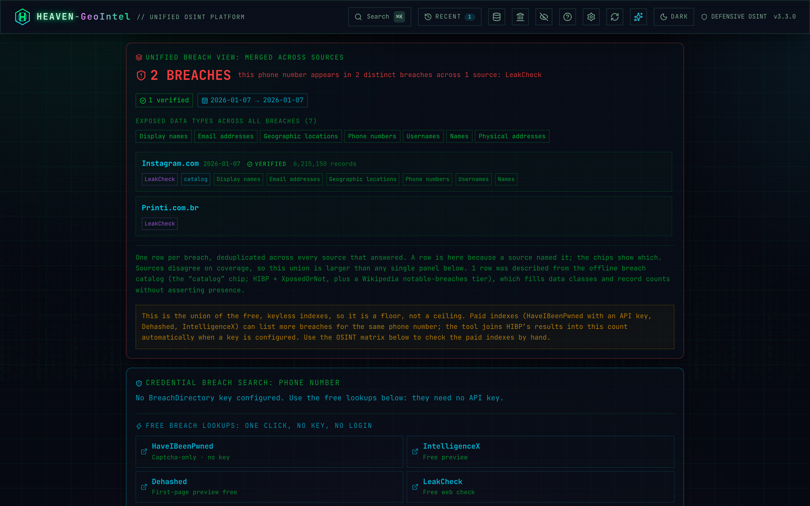

# 🌐 HEAVEN-GeoIntel

<p align="center">
  
</p>

<p align="center">

</p>

<p align="center">

</p>

---

> ### ⚠️ Acceptable use
>
> **HEAVEN-GeoIntel returns publicly-derivable metadata only.** It does **not** and **cannot** provide real-time GPS, live device tracking, or SS7 interception.
>
> Use this tool only:
> - Within an **explicit, written penetration-test scope of work**.
> - For OSINT research, journalism, or protecting yourself / your family / your organisation.
> - In ways that comply with the laws of **both your jurisdiction and the target's**.
>
> Stalking, harassment, doxing, domestic abuse, and any non-consensual surveillance are **explicitly prohibited** by the [LICENSE](./LICENSE). Misuse is the sole responsibility of the user.

---

## 🖼️ Screenshots

<table>
<tr>
<td width="50%"></td>
<td width="50%"></td>
</tr>
<tr>
<td width="50%"></td>
<td width="50%"></td>
</tr>
</table>

> Want to refresh these? Run `npm run dev` in one terminal and `npm run screenshots` in another — the [capture script](./scripts/capture-screenshots.mjs) uses puppeteer-core against your system Chrome and writes high-DPI PNGs into [`docs/screenshots/`](./docs/screenshots/).

---

<div align="center">

  <p>
    
    
    
    
    
  </p>

  <p>
    
    
    
    
  </p>

  <p>
    
    
    
    
    
  </p>

  <p>
    
    
  </p>

</div>

---

<a id="authors"></a>
## 👾 Authors

### Nisarg Chasmawala · Alias: **HEAVEN**

<div align="center">

| | Detail |
|---|---|
| 🔗 **LinkedIn** | [linkedin.com/in/nisarg-chasmawala](https://www.linkedin.com/in/nisarg-chasmawala) |
| 🐙 **GitHub** | [github.com/nishu2402](https://github.com/nishu2402) |
| 🎯 **Role** | Offensive Security Engineer · Penetration Tester · OSINT Analyst |

</div>

---

## 📋 Table of Contents

- [👾 Authors](#authors)
- [🧠 Project Summary](#project-summary)
- [💡 Core Idea](#core-idea)
- [🧭 The Workspace](#workspace)
- [🚀 Quick Start](#quick-start)
- [🐳 Docker Deployment](#docker-deployment)
- [📞 Phone Intelligence](#phone-intelligence)
- [📧 Email Intelligence](#email-intelligence)
- [🧑‍💻 Username Intelligence](#username-intelligence)
- [🌐 IP &amp; Domain Intelligence](#ip-domain-intelligence)
- [🕸️ Link-Analysis Graph &amp; Cases](#graph-cases)
- [≡ Bulk Mode](#bulk-mode)
- [🔑 Optional API Enrichment](#api-enrichment)
- [⚙️ How It Works](#how-it-works)
- [🔌 REST API](#rest-api)
- [✅ Data Accuracy](#data-accuracy)
- [🔒 Security](#security)
- [🧪 Tests](#tests)
- [📁 Project Structure](#project-structure)
- [⚡ Tech Stack](#tech-stack)
- [📜 Available Scripts](#available-scripts)
- [🔧 Troubleshooting](#troubleshooting)
- [🤝 Contributing](#contributing)
- [⚠️ Disclaimer](#disclaimer)

---

<a id="project-summary"></a>
## 🧠 Project Summary

<p align="center">

</p>

**HEAVEN-GeoIntel** is a production-ready, unified OSINT intelligence platform for **phone numbers, email addresses, usernames, IP addresses, and domains** — with a link-analysis graph and persistent investigation cases — built for penetration testers, security researchers, and OSINT analysts. It returns real, actionable intelligence: no placeholders, no simulations, no fake data.

<div align="center">

| Metric | Value |
|---|---|
| 🎯 **Scope** | Phone · Email · Username · IP · Domain · Bulk · Link-graph · Persistent cases |
| 🧭 **Workspace** | 8-mode unified console · ⌘K command palette · light/dark themes · 3D glass UI |
| 🔑 **Core Requirement** | Zero API keys — offline + free-source enrichment works out of the box |
| 📞 **Phone OSINT** | Carrier · type · NPA geo · fraud/threat score · pivots · QR · report export |
| 📧 **Email OSINT** | Breach (XposedOrNot) · reputation · identity · validation · credential hashes |
| 🧑‍💻 **Username OSINT** | 44 sites checked in parallel, grouped by category, presence-scored |
| 🌐 **IP / Domain OSINT** | IP geo + ASN + VPN/proxy flags · domain DNS + WHOIS + SPF/DMARC + cert-transparency subdomains |
| 🦠 **Infostealer Exposure** | **Hudson Rock Cavalier** — free, no key, always-on |
| 💥 **Breach Intelligence** | XposedOrNot (free) + BreachDirectory (RapidAPI) + 5 one-click free breach lookups |
| 🕸️ **Link-Analysis Graph** | Interactive SVG node graph of every identifier in a session/case · PNG export |
| 🗂️ **Persistent Cases** | File-backed investigation cases — group identifiers, notes, graph; survive restarts |
| 🗺️ **NPA Database** | 400+ US/CA area codes → state · metro · timezone (offline) |
| 🌍 **Country Dataset** | 100 countries — capital · currency · languages · GDP · emergency numbers |
| ⚡ **Cache / Persistence** | 24 h in-memory LRU (phone/email) · file-backed cases |
| 🚦 **Rate Limiting** | 10 requests/minute/IP — token bucket |
| 🔌 **REST API** | OpenAPI 3.1 spec at `/api/docs` · 8 endpoints |
| 🐳 **Container** | Multi-stage Dockerfile · `docker compose up -d` |
| 🧪 **CI / Tests** | Vitest · ESLint 9 · GitHub Actions on every PR · multi-arch ghcr image on push to `main` |
| 🏗️ **Stack** | Next.js 16 · TypeScript strict · Tailwind · Framer Motion · libphonenumber-js |
| 🎨 **UI Theme** | Hybrid cyberpunk glass — 3D tilt cards · neon glow · holographic borders · animated grid · Canvas katakana rain · **light + dark** · fully responsive |

</div>

---

<a id="core-idea"></a>
## 💡 Core Idea

<p align="center">

</p>

During a penetration test or OSINT investigation, analysts spend significant time manually pivoting across 20–30 separate tools and browser tabs to build intelligence around a single identifier. HEAVEN-GeoIntel centralises that workflow into one console — and lets you **link the identifiers together**:

```
Target  ─►  phone │ email │ username │ IP │ domain
        │
        ├─ Instant offline analysis    (libphonenumber-js · MCC/MNC · NPA · bundled datasets)
        ├─ Free no-key source fan-out   (Hudson Rock · XposedOrNot · Gravatar · EmailRep ·
        │                                ip-api · Cloudflare DoH · RDAP · crt.sh · 44 username sites)
        ├─ Optional API enrichment      (IPQualityScore · Twilio · Hunter.io · FullContact · BreachDirectory)
        ├─ OSINT pivot matrix           (38 phone links · 26 email links · tier-tagged · deduplicated)
        ├─ Link-analysis graph          (connect phone ⇄ email ⇄ username ⇄ IP ⇄ domain)
        ├─ Persistent cases             (group identifiers across sessions · analyst notes)
        └─ Export                       (.txt · .html report · CSV · graph PNG)
```

> **Scope:** Returns publicly derivable *metadata* only. Does **not** provide real-time GPS, live device tracking, SS7 interception, or any form of unauthorized surveillance.

---

<a id="workspace"></a>
## 🧭 The Workspace

<p align="center">

</p>

One unified console with an **8-mode switcher**. The first five are live lookups; the last three are workflow tools.

<div align="center">

| Mode | What it does |
|---|---|
| 📡 **Phone** | Full phone OSINT — carrier, breach, infostealer, identity, pivots |
| ✉ **Email** | Full email OSINT — breach, reputation, identity, validation, pivots |
| @ **Username** | Check a handle across 44 sites in parallel (found / unverified) |
| ⦿ **IP** | Geo · ASN · ISP · reverse DNS · VPN/proxy/hosting flags · risk score |
| 🌐 **Domain** | DNS · WHOIS · SPF/DMARC posture · cert-transparency subdomains |
| ≡ **Bulk** | Triage up to 25 phone numbers → CSV export |
| 🕸 **Graph** | Link-analysis graph of every identifier looked up this session |
| 🗂 **Cases** | Persistent investigation cases — group identifiers, notes, per-case graph |

</div>

- **⌘K / Ctrl+K command palette** — type any identifier and it auto-detects the type and runs the lookup; jump between modes; toggle the theme. Powered by [`cmdk`](https://github.com/pacocoursey/cmdk).
- **Keyboard-first** — press `1`–`8` to switch mode, `/` to focus the input, `⌘K` for the palette. A `?` help button lists every mode and shortcut.
- **Example chips** under each empty input ("Try `+1 415 555 2671`…") so you're never staring at a blank box, and every lookup gets a shareable URL (`?mode=…&q=…`) — bookmark or hand off any result, in any mode.
- **At-a-glance summary** at the top of a phone result (line type · carrier · location · breach · infostealer) plus a "jump to" nav, so you find the answer without scrolling 12 panels. Hover any acronym (E.164, NPA, CNAM…) for a plain-language tooltip.
- **Sources & keys panel** — one click shows which data sources are live and which optional API keys are configured (booleans only; keys never leave the server), so an empty field is self-explanatory.
- **Light + dark themes** + a **visual-effects toggle** that honours `prefers-reduced-motion` — a persisted toggle with an anti-flash boot script. The UI is a hybrid "cyberpunk glass" design: 3D parallax-tilt cards, neon glow, holographic borders, an animated grid backdrop, and the signature Canvas katakana rain (which respects reduced-motion and the toggle).
- **Session graph** — every successful lookup adds a node, so by the end of an investigation you have a visual map of how the identifiers connect (exportable as PNG).

---

<a id="quick-start"></a>
## 🚀 Quick Start

<p align="center">

</p>

### One-click deploy

[](https://vercel.com/new/clone?repository-url=https%3A%2F%2Fgithub.com%2Fnishu2402%2FHEAVEN-GeoIntel&project-name=heaven-geointel&repository-name=HEAVEN-GeoIntel)
[](https://railway.com/new)
[](https://render.com/deploy)

Or pull the pre-built container:

```bash
docker run -d --name geointel -p 3000:3000 ghcr.io/nishu2402/heaven-geointel:latest
```

### Requirements

- **Node.js 20.9 or higher** — [nodejs.org](https://nodejs.org) (Next.js 16 requires Node 20.9+; the bundled [`.nvmrc`](./.nvmrc) pins v20)
- **npm 10 or higher** — included with Node.js 20+
- No database, no Redis, no cloud account required. Docker is **optional** — see the [Docker section](#docker-deployment) if you prefer a container.

```bash
node -v   # must be v20.9.0 or higher
npm -v    # must be 10.0.0 or higher
```

### Clone & install

```bash
git clone https://github.com/nishu2402/HEAVEN-GeoIntel.git
cd HEAVEN-GeoIntel
npm install
```

> No Git installed? Install it from [git-scm.com](https://git-scm.com), or download the project as a ZIP (**Code → Download ZIP**) and extract it.
>
> **Moving the project to another PC?** Do **not** copy `node_modules` — it contains OS-specific binaries. Copy only the source, then run `npm install` fresh.

### One-command start

```bash
bash scripts/start.sh        # PRODUCTION mode: builds once, serves on your LAN, self-tests
bash scripts/start.sh --dev  # hot-reload dev server (local only)
# or
npm run setup                # npm equivalent of dev mode
```

The default (production) mode builds the app and serves it bound to all
interfaces, then **self-tests** both the Local and Network URLs and prints the
result. Dev mode is for local hot-reload only — Next 16's dev server blocks
cross-origin requests to its internals, so it is **not** reachable from other
devices.

### Open it on your phone (same Wi-Fi)

`bash scripts/start.sh` prints a **Network** URL like `http://192.168.0.231:3000`
and verifies it is reachable. Open **that exact URL** on your phone — **never
`0.0.0.0`** (that is what Next's own banner prints; it means "all interfaces",
not an address a phone can open).

If your phone still can't load it, the server is fine and the block is your
network. Diagnose it:

```bash
bash scripts/start.sh --doctor   # checks firewall, VPN, interface, AP isolation
npm run doctor                   # same
```

The two usual causes: the phone is on a different Wi-Fi/Guest network, or the
router has **"AP isolation" / "client isolation"** turned on (toggle it off in
the router settings). macOS may also prompt once to allow `node` to accept
incoming connections — click **Allow**.

### Global command

After running `bash scripts/start.sh` once, a `geointel` shell function is registered in `~/.zshrc`. Open a new terminal and type `geointel`. To register it manually any time: `npm run install-global`; to remove it: `npm run uninstall-global`.

### Security & operations (optional)

| Want to… | Do this |
|---|---|
| **Require a login** before the app/API (e.g. when exposing it on a LAN) | set `AUTH_PASSWORD` (and optionally `AUTH_USER`, default `analyst`) — enables HTTP Basic auth on everything except `/api/health`. Off by default. |
| **Keep an audit trail** of lookups | automatic — `.data/audit.log` records type · **hashed** target · time · status. Set `AUDIT_PLAINTEXT=1` to store raw targets. |
| **Health-check** the service | `GET /api/health` → `{ status: "ok", … }` (also the Docker healthcheck). |
| **Wipe everything** (cases + audit log) | the **WIPE ALL** button in the Cases tab, or `curl -X DELETE '<host>/api/cases?all=1'`. |
| **Export / hand off a case** | Cases tab → **JSON** (re-importable, SHA-256 integrity-hashed) or **REPORT** (Markdown). Re-import verifies the hash and warns on tampering. |

Persistent data lives in `.data/` (`cases.json`, `audit.log`), written owner-only (`0600`) and git-ignored.

---

<a id="docker-deployment"></a>
## 🐳 Docker Deployment

<p align="center">

</p>

A multi-stage `Dockerfile` and `docker-compose.yml` ship with the repo. The runtime image weighs **under 200 MB**, runs as a non-root user, and reads optional API keys from your `.env.local` at start-up.

```bash
# Compose (build + start in the background)
docker compose up -d
open http://localhost:3000          # macOS — Linux: xdg-open, Windows: start

# Plain Docker (no compose)
docker build -t heaven-geointel:1.3 .
docker run --rm -p 3000:3000 --env-file .env.local heaven-geointel:1.3
```

<div align="center">

| Layer | Purpose | Size impact |
|---|---|---|
| `deps`    | `npm ci` against a frozen `package-lock.json` | cache-friendly |
| `builder` | `next build` — emits the production bundle  | discarded |
| `runner`  | `node:20-alpine` + non-root user + `next start` | < 200 MB final |

</div>

**Tips** — update API keys: edit `.env.local` then `docker compose restart`. Custom port: set `PORT` or change the `ports:` mapping. Logs: `docker compose logs -f geointel`. A built-in health check shows the container as `(healthy)` once the API responds. In production, terminate TLS in your nginx/Caddy/Traefik and proxy to `localhost:3000`.

---

<a id="phone-intelligence"></a>
## 📞 Phone Intelligence

<p align="center">

</p>

Every phone lookup returns real data derived from the number structure and bundled datasets — no simulation, no placeholders.

<div align="center">

| Panel | What It Shows |
|---|---|
| **Result Header** | E.164 · country flag · validity · unified **Threat Score (0–100)** with colour-coded label |
| **Identity — Owner Profile** | Real name · employer · social profiles (FullContact). With no key, it points you to the **OSINT Pivot Matrix** — one deduplicated set of reverse-lookup links (no repeated or dead links). |
| **Credential Breach Search** | BreachDirectory password-hash hits (with key) + 5 always-on **one-click free breach lookups** (HaveIBeenPwned · IntelligenceX · Dehashed · LeakCheck · Snusbase). |
| **Infostealer Malware Exposure** | Hudson Rock — **no key**. Every infected device that captured the number, paired credential samples, captured sites, malware family, OS, capture date. |
| **Phone OSINT Intelligence** | Intelligence Score · Target Profile classifier · Attack-Vector grid (Vishing/Smishing/SIM-Swap/Spoofing/Pretexting/Location) · live local time · call window · NPA intel · offline signals |
| **Location Intelligence** | Country · state/province · metro · city · area code · timezone + UTC offset |
| **Country Intelligence** | Capital · continent · region · population · currency · languages · driving side · emergency number · GDP per capita |
| **Number Anatomy** | One consolidated panel — visual digit breakdown · line type + description · libphonenumber validity checks · all four formats (E.164 / International / National / RFC 3966) |
| **SIM & Carrier Intel** | Owner/CNAM · carrier (incl. offline MCC/MNC → operator) · prepaid · active status · MCC/MNC/PLMN · associated emails |
| **Number Permutations** | 12 format variants for OSINT/database searching |
| **OSINT Pivots** | 38 links across 5 categories, each tagged **FREE / CAPTCHA / LOGIN / PAID**; filter chips default to FREE + CAPTCHA. Every link takes the number directly — no dead "did not match any documents" results |
| **QR Code** | Canvas-rendered QR for the `tel:` URI · downloadable as PNG |
| **Report Export** | Full intelligence report as `.txt` or `.html` |
| **History Drawer** | Last 20 lookups (browser localStorage) |
| **Shareable URL** | `?q=+14155552671` auto-runs the lookup |

</div>

### Phone OSINT Pivots — 38 links, 5 categories

One **single, deduplicated** link matrix — every service appears exactly once, every link takes the number directly to a results page. Breach lookups live in the dedicated Breach panel, not here.

<div align="center">

| Category | Count | Default tier |
|---|---|---|
| **Identity / Reverse Lookup** | 18 | FREE first, login/paid behind filter chips |
| **Messaging — Is it Registered?** | 6 | all FREE |
| **Spam / Abuse Reports** | 6 | all FREE |
| **Carrier / HLR / Telecom** | 3 | mix of FREE / CAPTCHA / PAID |
| **Search Engines (broad)** | 5 | all FREE |

</div>

### Accepted formats

```
+14155552671          # E.164 (recommended)        +91 98765 43210   # Indian
+44 7911 123456       # International with spaces   001 (415) 555-2671 # US with IDD prefix
```

---

<a id="email-intelligence"></a>
## 📧 Email Intelligence

<p align="center">

</p>

Every email lookup runs offline analysis instantly, then fans out to free data sources in parallel.

<div align="center">

| Panel | What It Shows |
|---|---|
| **Identity Header** | Confirmed name (FullContact → Gravatar → inferred) · avatar · job title · employer · location · bio · threat-score bar |
| **Threat Score** | 0–100 — breach count · password-risk level · recency · reputation signals |
| **FullContact Enrichment** | Real name · age · gender · social profiles · linked emails & phones · employment history (optional key) |
| **Breach Database** | XposedOrNot — 1000+ databases, no key. Per-breach: name · year · records · exposed data types · password-risk level (Plaintext / Easy-Crack / Hashed) |
| **Credential Hashes** | BreachDirectory — real SHA-1/MD5 hashes with one-click crack buttons (CrackStation · Hashes.com) — optional RapidAPI key |
| **Email Classification** | Provider type (corporate/free/disposable/privacy/gov/edu) · disposable detection (1,200+ domains) · free-webmail (370+) · privacy hosts (70+) · role-address detection |
| **Reputation** | EmailRep.io: suspicious · blacklisted · malicious · credentials leaked · spam · first/last seen · registered platforms |
| **Validation / Deliverability** | AbstractAPI (SMTP/MX, quality, catch-all) · Hunter.io (deliverable/risky/undeliverable + confidence) |
| **OSINT Matrix** | 26 investigation links across 4 categories |
| **Report Export** | Full report as `.txt` including breach + FullContact data |

</div>

### Accepted formats

```
user@domain.com   ·   first.last@corporate.org   ·   user+tag@provider.net
```

---

<a id="username-intelligence"></a>
## 🧑‍💻 Username Intelligence

<p align="center">

</p>

Enter a handle and HEAVEN-GeoIntel checks **44 sites** for it. **29 are auto-verified server-side** (so no CORS limits) and marked **FOUND** or **UNVERIFIED**. The other **15 are JS apps or bot-walls that return HTTP 200 for *every* username** (Instagram, TikTok, X, Reddit, Telegram, …) — a server probe genuinely can't tell if the handle exists there, so the tool **never guesses**: it flags them **VERIFY →** as one-click links you open to confirm. That's the difference between this and tools that proudly report "found on 40 sites" — most of those are false positives.

<div align="center">

| Category | Example sites |
|---|---|
| **Developer** | GitHub · GitLab · Replit · Docker Hub · PyPI · npm · CodePen · Kaggle · Codeberg |
| **Social** | Instagram · X/Twitter · TikTok · Reddit · Telegram · Threads · Mastodon · Bluesky · VK · Pinterest |
| **Creative / Media** | YouTube · SoundCloud · Spotify · Behance · Dribbble · DeviantArt · Flickr · Vimeo · Medium · Patreon |
| **Gaming** | Twitch · Steam · Xbox · Chess.com · Roblox |
| **Professional / Forum** | Keybase · About.me · Gravatar · Linktree · Product Hunt · Wattpad · Last.fm · Trello · Hacker News |

</div>

- A **presence score** summarises how many sites the handle appears on.
- Pivot links (WhatsMyName · Sherlock · IntelligenceX · broad Google sweep) for deeper enumeration.
- Free · no API key · validated input (`[A-Za-z0-9._-]`, 2–40 chars).

---

<a id="ip-domain-intelligence"></a>
## 🌐 IP &amp; Domain Intelligence

<p align="center">

</p>

Both are **free, no-key**, and validate input before any outbound request.

### ⦿ IP intelligence (`ip-api` · Shodan InternetDB · GreyNoise)

| Section | Fields |
|---|---|
| **Geolocation** | City · region · country · continent · postal · lat/lon · timezone + UTC offset · OpenStreetMap link |
| **Network / ASN** | ASN · AS org · ISP · organisation · reverse DNS (PTR) |
| **Internet exposure** | Open ports · known CVEs (linked to NVD) · hostnames · classifier tags — Shodan InternetDB, free |
| **Risk flags** | VPN/proxy · hosting/datacenter · mobile · Tor · GreyNoise classification — folded into a 0–100 IP-risk score |
| **Pivots** | Shodan · Censys · AbuseIPDB · VirusTotal · GreyNoise · IPinfo · Spur · BGP.he.net · Google sweep |

Accepts IPv4 and IPv6.

### 🌐 Domain intelligence (DNS-over-HTTPS · RDAP · crt.sh)

| Section | Source |
|---|---|
| **DNS records** | A · AAAA · MX · NS · CNAME · TXT — via Cloudflare DNS-over-HTTPS |
| **Email-security posture** | SPF present? · DMARC policy (none/quarantine/reject) · MX present? |
| **WHOIS** | Registrar · created / updated / expires · nameservers · status — via RDAP (no key) |
| **Subdomains** | Discovered through certificate transparency (crt.sh), up to 100 |
| **Pivots** | crt.sh · SecurityTrails · VirusTotal · Shodan · URLScan · Wayback · DNSDumpster · MXToolbox |

Accepts bare domains or full URLs (scheme/path/`www.` are stripped automatically).

---

<a id="graph-cases"></a>
## 🕸️ Link-Analysis Graph &amp; Persistent Cases

<p align="center">

</p>

### Session link graph

Every successful lookup (phone, email, username, IP, domain) adds a colour-coded node to an interactive SVG graph, connected to a central **TARGET**. Hover to highlight, and **export the whole chart as a PNG** for your report. It turns a session of scattered lookups into one visual map of how the identifiers relate.

### Investigation cases (persistent)

- Create named **cases** and add any identifiers to them.
- Each case stores its own **link graph** and free-form **analyst notes**.
- Backed by a file store (`.data/cases.json`) so cases **survive server restarts** and sessions — no database required.
- Full CRUD via the UI or the [`/api/cases`](#rest-api) endpoint.

> Cases are **unauthenticated** by design (single-user / self-hosted assumption). If you expose the app publicly, put an auth proxy in front — see [SECURITY.md](./SECURITY.md).

---

<a id="bulk-mode"></a>
## ≡ Bulk Mode

<p align="center">

</p>

Paste up to **25 phone numbers** into the `≡ BULK` tab, one per line or comma-separated. The endpoint runs **offline-only analysis** on each number (libphonenumber + NPA + bundled country data + reused cache) and returns a flat result table, downloadable as **CSV** in one click.

Why offline-only? Most free APIs cap at 100–250 calls/day; a bulk batch would burn an entire day's quota. Use bulk to **triage**, then drill into the interesting rows from the PHONE tab for full enrichment.

```bash
curl -s http://localhost:3000/api/bulk-lookup \
  -H 'content-type: application/json' \
  -d '{"numbers":["+14155552671","+447911123456","+919876543210"]}' | jq .
```

Returns `{ count, rows: [{ input, ok, e164, country, type, carrier, timezone, utcOffset, npaState, npaRegion, cached }] }`.

---

<a id="api-enrichment"></a>
## 🔑 Optional API Enrichment

<p align="center">

</p>

The app works fully without API keys (offline analysis + free no-key sources). Add keys to `.env.local` for deeper intelligence.

<div align="center">

| Service | What It Adds | Tier |
|---|---|---|
| **Hudson Rock Cavalier** | Phone/email infostealer-malware exposure | **free · no key** (always-on) |
| **IPQualityScore** | Fraud score · VoIP · abuse · prepaid · active · city · associated emails | 200/day free |
| **NumVerify** | Carrier · line type · location | 100/mo free |
| **AbstractAPI** | Phone validation **and** email SMTP/MX/quality | 250/mo free |
| **Twilio Lookup v2** | Carrier · owner/CNAM · MCC/MNC | ~$0.005/lookup |
| **BreachDirectory** (RapidAPI) | Real SHA-1/MD5 credential hashes (phone + email) | 50/day free |
| **FullContact** | Real name · employer · social profiles · linked contacts | 500/mo free |
| **Hunter.io** | Email deliverability + confidence | 25/mo free |
| **EmailRep.io** | Reputation · breach flags · platform registrations | works without key |

</div>

```env
# .env.local — add any or all, leave blank to skip
NUMVERIFY_API_KEY=
IPQS_API_KEY=
ABSTRACT_API_KEY=          # phone + email validation
TWILIO_ACCOUNT_SID=
TWILIO_AUTH_TOKEN=
HUNTER_API_KEY=
EMAILREP_API_KEY=
FULLCONTACT_API_KEY=       # person enrichment
RAPIDAPI_KEY=              # BreachDirectory credential hashes
TRUST_PROXY=               # set to 1 behind nginx/Cloudflare to rate-limit per real IP
```

Sign up: [IPQualityScore](https://www.ipqualityscore.com) · [NumVerify](https://numverify.com) · [AbstractAPI](https://www.abstractapi.com) · [Twilio](https://www.twilio.com) · [Hunter.io](https://hunter.io) · [EmailRep.io](https://emailrep.io) · [FullContact](https://www.fullcontact.com) · [BreachDirectory on RapidAPI](https://rapidapi.com/rohan-patra/api/breachdirectory)

---

<a id="how-it-works"></a>
## ⚙️ How It Works

<p align="center">

</p>

```
POST /api/lookup        { number }   → libphonenumber + NPA + country dataset + MCC/MNC (offline)
                                       ‖ Hudson Rock (free) ‖ optional: NumVerify · IPQS · Abstract ·
                                         Twilio · BreachDirectory · FullContact  (Promise.allSettled)

POST /api/email-lookup  { email }    → offline classification + name inference
                                       ‖ Gravatar · XposedOrNot · EmailRep (free) ‖ optional:
                                         FullContact · BreachDirectory · Abstract · Hunter.io

POST /api/username-lookup { username } → 29 auto-verified + 15 manual → found / notfound / unverified / manual
POST /api/ip-lookup     { ip }       → ip-api: geo · ASN · ISP · reverse DNS · proxy/hosting/mobile + risk
POST /api/domain-lookup { domain }   → Cloudflare DoH (A/AAAA/MX/NS/CNAME/TXT) ‖ RDAP whois ‖
                                       crt.sh subdomains ‖ SPF/DMARC posture
```

Every route validates input first and only interpolates it (URL-encoded) into **fixed** upstream hosts — never an attacker-chosen host (no SSRF). A single source failing never fails the whole lookup.

**Caching:** phone + email results cached in-memory 24 h (500 entries, LRU). **Persistence:** cases written to `.data/cases.json`, survive restarts. **Rate limiting:** 10 req/min/IP → HTTP 429 + `Retry-After: 60`.

---

<a id="rest-api"></a>
## 🔌 REST API

<p align="center">

</p>

Every UI feature is also a JSON API. OpenAPI 3.1 spec at `GET /api/docs` — import into Postman, Insomnia, or Swagger UI.

```bash
curl -s localhost:3000/api/lookup        -H 'content-type: application/json' -d '{"number":"+14155552671"}' | jq .threatScore
curl -s localhost:3000/api/email-lookup  -H 'content-type: application/json' -d '{"email":"test@example.com"}' | jq .
curl -s localhost:3000/api/username-lookup -H 'content-type: application/json' -d '{"username":"torvalds"}' | jq '{found, checked}'
curl -s localhost:3000/api/ip-lookup     -H 'content-type: application/json' -d '{"ip":"8.8.8.8"}' | jq '.ip | {city, asnOrg, isHosting}'
curl -s localhost:3000/api/domain-lookup -H 'content-type: application/json' -d '{"domain":"github.com"}' | jq '{mx:.dns.mx, dmarc:.emailSecurity.dmarcPolicy}'
curl -s localhost:3000/api/bulk-lookup   -H 'content-type: application/json' -d '{"numbers":["+14155552671","+447911123456"]}' | jq .
curl -s localhost:3000/api/cases | jq '.cases'
curl -s localhost:3000/api/docs  | jq .info
```

The ten endpoints: `/api/lookup` · `/api/email-lookup` · `/api/username-lookup` · `/api/ip-lookup` · `/api/domain-lookup` · `/api/bulk-lookup` · `/api/cases` · `/api/sources` · `/api/health` · `/api/docs`. Lookup routes return `X-RateLimit-*` headers and `X-Robots-Tag: noindex`. `/api/sources` reports which optional API keys are configured (booleans only — never the values).

---

<a id="data-accuracy"></a>
## ✅ Data Accuracy

<p align="center">

</p>

### Phone — always accurate (offline, zero APIs)

- Country · calling code · flag emoji · validity (libphonenumber strict)
- Number type — mobile / fixed / VoIP / toll-free / premium / pager / personal
- Ambiguous `FIXED_LINE_OR_MOBILE` shown as "TYPE AMBIGUOUS" — never falsely claimed
- IANA timezone + UTC offset (110+ countries) · all 4 formats · expected digit length
- Area code extracted for US/CA only (real NPA database — other countries use variable-length codes, so guessing would fabricate data)
- State / metro / local timezone for US/CA (NPA database)

### Email — offline analysis (zero APIs)

- Disposable (1,200+ domains) · privacy (70+) · free-webmail (370+) · role-address (160+ prefixes) · government/military · educational detection
- Provider name resolution (50+) · name inference from username patterns

### Username · IP · Domain (free live sources)

- **Username** — **FOUND** only on a confirmed 200 / known profile marker. The 15 sites that return HTTP 200 for *every* handle (Instagram, TikTok, X, Reddit, …) are **never auto-claimed** — they're flagged **VERIFY →** so you open them yourself. A nonexistent handle yields **zero** false positives (regression-tested). Sites that block bots land in UNVERIFIED, never silently dropped.
- **IP** — geolocation is **ISP-level, not a precise address** (stated in the UI). Hosting / VPN / proxy IPs mask the real user; we surface those flags instead of pretending the location is the person.
- **Domain** — DNS / WHOIS / subdomain data is reported exactly as upstream resolvers return it. Empty sections mean "not resolved," never fabricated. WHOIS depends on the TLD's RDAP support.
- **Offline carrier (MCC/MNC)** — resolved from a bundled operator table only when network codes are known; otherwise left blank.

---

<a id="security"></a>
## 🔒 Security

<p align="center">

</p>

<div align="center">

| Control | Implementation |
|---|---|
| **API key isolation** | Every external fetch happens in `src/app/api/*` server routes — keys never reach the browser bundle (`grep -r "process.env" .next/static/` returns nothing). |
| **Security headers** | `X-Frame-Options: DENY` · `X-Content-Type-Options: nosniff` · `Referrer-Policy` · `Permissions-Policy` (geo/camera/mic/payment/usb blocked) · `Cross-Origin-Opener-Policy` · `Cross-Origin-Resource-Policy` |
| **CSP** | `default-src 'self'` · `connect-src 'self'` · `object-src 'none'` · `frame-ancestors 'none'` · `base-uri 'self'` · `upgrade-insecure-requests` · narrowed image allow-list |
| **API hardening** | Lookup routes: `X-Robots-Tag: noindex` + `Cache-Control: no-store`. No `Access-Control-Allow-Origin` is sent, so browsers enforce same-origin by default. |
| **Input validation / no SSRF** | Every lookup validates input (libphonenumber · IPv4/IPv6 · domain regex · `[A-Za-z0-9._-]{2,40}` usernames) and only URL-encodes it into **fixed** hosts — callers can't choose the destination. |
| **Image optimizer disabled** | App uses plain ``; `images.unoptimized` removes the `/_next/image` attack surface. |
| **No tracking** | Metadata from structure + public databases only. No geolocation, device tracking, analytics, or telemetry. |
| **Rate limiting** | 10 req/min/IP token-bucket · `Retry-After: 60` on 429 |
| **Panel isolation** | Every results panel wrapped in `PanelErrorBoundary` — a broken upstream response takes down one card, not the page. |
| **Disclosure policy** | [SECURITY.md](./SECURITY.md) — private GitHub Security Advisory flow + documented dependency advisories. |

</div>

---

<a id="tests"></a>
## 🧪 Tests

<p align="center">

</p>

```bash
npm test              # Vitest, run once
npm run test:watch    # watch mode
npm run test:coverage # text + html report under coverage/
npm run typecheck     # tsc --noEmit
npm run lint          # ESLint 9 (flat config)
```

Every push to `main` and every PR runs `lint → typecheck → test → build` via GitHub Actions ([`.github/workflows/ci.yml`](./.github/workflows/ci.yml)). Pushes to `main` also publish a multi-arch image to [`ghcr.io/nishu2402/heaven-geointel`](https://github.com/nishu2402/HEAVEN-GeoIntel/pkgs/container/heaven-geointel).

---

<a id="project-structure"></a>
## 📁 Project Structure

<p align="center">

</p>

All source lives under `src/`, grouped by feature. Tests under `tests/`, shell + tooling scripts under `scripts/`, docs under `docs/`.

```text
HEAVEN-GeoIntel/
├── .github/                          CI workflows · issue/PR templates
├── docs/screenshots/                 README screenshots
├── scripts/
│   ├── start.sh · install-global.sh  one-step start + global `geointel` command
│   └── capture-screenshots.mjs       regenerate README screenshots (puppeteer-core)
│
├── src/
│   ├── app/                          Next.js App Router
│   │   ├── api/
│   │   │   ├── lookup/route.ts          phone
│   │   │   ├── email-lookup/route.ts    email
│   │   │   ├── username-lookup/route.ts username enumeration (44 sites)
│   │   │   ├── ip-lookup/route.ts       IP geo/ASN/risk
│   │   │   ├── domain-lookup/route.ts   DNS · WHOIS · subdomains
│   │   │   ├── bulk-lookup/route.ts     bulk phone (max 25)
│   │   │   ├── cases/route.ts           persistent investigation cases (CRUD)
│   │   │   └── docs/route.ts            OpenAPI 3.1 spec
│   │   ├── layout.tsx · page.tsx · globals.css · not-found.tsx · robots.ts
│   │
│   ├── components/
│   │   ├── phone/        PhoneInput · PentesterPanel · NumberAnatomyPanel ·
│   │   │                 NumberPermutations · PhoneIdentityPanel · SimIntelPanel
│   │   ├── email/        EmailInput · EmailResultsDashboard · EmailOsintPivots
│   │   ├── username/     UsernameResultsDashboard
│   │   ├── network/      IpResultsDashboard · DomainResultsDashboard
│   │   ├── breach/       BreachPanel · InfostealerPanel
│   │   ├── graph/        LinkGraph (SVG node graph + PNG export)
│   │   ├── cases/        CasesPanel (CRUD · entities · notes · per-case graph)
│   │   ├── dashboard/    ResultsDashboard · BulkLookup · HistorySidebar ·
│   │   │                 LoadingSkeletons · SourceTabs
│   │   ├── osint/        OsintPivots · LocationPanel ·
│   │   │                 CountryPanel · QrCodePanel
│   │   ├── shared/       ThemeProvider · ThemeToggle · CommandPalette ·
│   │   │                 SimpleLookupInput · Tilt3D · MatrixRain · BootSequence ·
│   │   │                 PanelErrorBoundary · ShareButton · ReportExport
│   │   └── ui/           shadcn/ui primitives (Radix)
│   │
│   └── lib/
│       ├── phoneAnalysis.ts · emailAnalysis.ts · freePhoneIntel.ts
│       ├── mccMnc.ts            MCC/MNC → operator database (offline)
│       ├── usernameSites.ts     44-site enumeration catalog
│       ├── caseStore.ts         file-backed cases (.data/cases.json)
│       ├── modes.ts             8-mode registry + identifier auto-detection
│       ├── countryIntel.ts · usNpaDatabase.ts · disposableEmailDomains.ts
│       ├── hashDetect.ts · cache.ts · rateLimit.ts · types.ts · utils.ts
│
├── tests/                            Vitest suites
├── .env.example · eslint.config.mjs · .nvmrc (20) · .dockerignore
├── CHANGELOG.md · CODE_OF_CONDUCT.md · CONTRIBUTING.md · SECURITY.md · LICENSE
├── Dockerfile · docker-compose.yml · next.config.mjs (hardened CSP/headers)
├── package.json · tsconfig.json (@/* → ./src/*) · tailwind.config.ts · vitest.config.ts
```

---

<a id="tech-stack"></a>
## ⚡ Tech Stack

<p align="center">

</p>

<div align="center">

| Layer | Technology |
|---|---|
| **Framework** | Next.js 16 (App Router) · React 19 |
| **Language** | TypeScript (strict) — full interface tree for all data types |
| **Phone Parsing** | `libphonenumber-js` (Google's libphonenumber compiled to JS) |
| **UI** | Tailwind CSS · shadcn/ui (Radix) · CSS design tokens · light + dark themes · fully responsive |
| **UX** | `cmdk` ⌘K command palette · 3D tilt cards · holographic borders · glassmorphism |
| **Animation / Viz** | Framer Motion · Canvas API (katakana rain · QR) · hand-rolled SVG link graph |
| **Breach / Infostealer** | Hudson Rock Cavalier (free) · XposedOrNot (free) · BreachDirectory via RapidAPI |
| **Username OSINT** | 44-site parallel existence checks (server-side, no key) |
| **IP / Domain OSINT** | ip-api · Cloudflare DNS-over-HTTPS · RDAP · crt.sh (all free · no key) |
| **Identity / Reputation** | FullContact · Gravatar · EmailRep.io · Hunter.io |
| **Phone Enrichment** | IPQualityScore · NumVerify · AbstractAPI · Twilio (all optional) |
| **Persistence** | In-memory LRU cache (24 h · 500 entries) · file-backed cases (`.data/`) |
| **Rate Limiting** | Token-bucket per IP · 10 req/min |
| **Quality** | ESLint 9 (flat config) · Vitest · GitHub Actions CI |
| **Font** | JetBrains Mono · 15 px base |

</div>

---

<a id="available-scripts"></a>
## 📜 Available Scripts

<p align="center">

</p>

<div align="center">

| Command | What It Does |
|---|---|
| `bash scripts/start.sh` | One-step **production** start: build · serve on your LAN · self-test (add `--dev` for hot reload) |
| `npm run setup` | Install deps + start the hot-reload dev server (local only) |
| `npm run install-global` | Register the `geointel` shell command in `~/.zshrc` |
| `npm run dev` | Start dev server |
| `npm run build` | Production build |
| `npm run start` | Start production server (after `npm run build`) |
| `npm run lint` | ESLint 9 (flat config) |
| `npm run typecheck` | `tsc --noEmit` type-check |
| `npm test` · `npm run test:watch` · `npm run test:coverage` | Vitest |
| `npm run screenshots` | Regenerate README screenshots (needs the dev server running) |
| `docker compose up -d` · `down` · `logs -f geointel` | Container lifecycle |

</div>

---

<a id="troubleshooting"></a>
## 🔧 Troubleshooting

<p align="center">

</p>

**Port 3000 already in use** — `start.sh` auto-detects the next free port and prints the URL.

**Phone shows INVALID** — include the full calling code (`+1`, `+44`, …) or pick the country from the combobox; it formats automatically.

**Carrier / fraud score missing** — those require API keys in `.env.local`. Country, type, timezone, and all format data populate without any keys.

**Email breach panel empty** — XposedOrNot may rate-limit repeats; retry shortly. A clean "no exposures" result is a valid (good) outcome.

**Username / IP / domain shows UNVERIFIED or empty** — these use free public sources; a site that blocks automated checks shows as UNVERIFIED (open it manually). `crt.sh` and RDAP occasionally rate-limit/time out — retry. Empty ≠ fabricated.

**`npm run dev` fails with MODULE_NOT_FOUND** — use `bash scripts/start.sh` or `npm run setup`; both invoke Next via `node node_modules/next/dist/bin/next` to bypass symlink issues.

**`npm install` / `npm run build` fails on another PC** — almost always an outdated Node. Run `node -v` — it must be **v20.9.0+** (Next 16 requires it). Install the LTS from [nodejs.org](https://nodejs.org) or `nvm install 20 && nvm use 20`. An `EBADENGINE` error means exactly this. If you copied the folder, delete `node_modules` and run `npm install` fresh.

---

<a id="contributing"></a>
## 🤝 Contributing

<p align="center">

</p>

Contributions are welcome. Read **[CONTRIBUTING.md](./CONTRIBUTING.md)** for the workflow, ground rules (no fake data, no real-time tracking, TypeScript strict, mobile-first), and the PR checklist. Before opening a PR:

```bash
npm run lint && npm run typecheck && npm test && npm run build
```

Adding a new **OSINT source** or **pivot link**? The guide has a dedicated checklist. Found a security issue? Use the private flow in **[SECURITY.md](./SECURITY.md)** — please don't open a public issue. By contributing you agree to the [Code of Conduct](./CODE_OF_CONDUCT.md).

<div align="center">

| Document | Purpose |
|---|---|
| [`LICENSE`](./LICENSE) | MIT + OSINT acceptable-use policy |
| [`SECURITY.md`](./SECURITY.md) | Vulnerability disclosure + dependency advisories |
| [`CODE_OF_CONDUCT.md`](./CODE_OF_CONDUCT.md) | Contributor Covenant v2.1 |
| [`CHANGELOG.md`](./CHANGELOG.md) | Release notes (Keep-a-Changelog) |

</div>

---

<a id="disclaimer"></a>
## ⚠️ Disclaimer

<p align="center">

</p>

> **HEAVEN-GeoIntel is an OSINT research and authorized penetration-testing tool.**
>
> It returns publicly derivable *metadata* only. It does **not** and **cannot** provide real-time GPS location, live device tracking, SS7 interception, or any form of unauthorized surveillance.
>
> Use only within your authorized engagement scope. Unauthorized use against systems or individuals you do not have explicit permission to investigate may be illegal in your jurisdiction.

---

<p align="center">

</p>

<p align="center">
<strong>⭐ If this project helped you, please give it a star on GitHub!</strong>
</p>

<p align="center">


</p>
