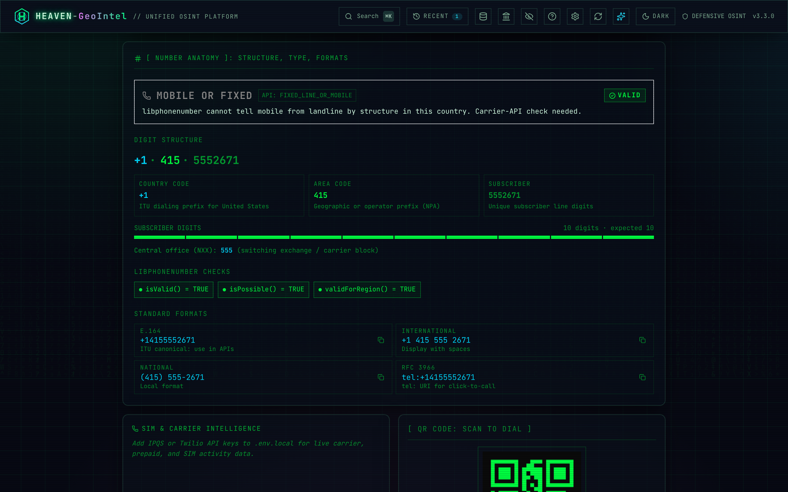
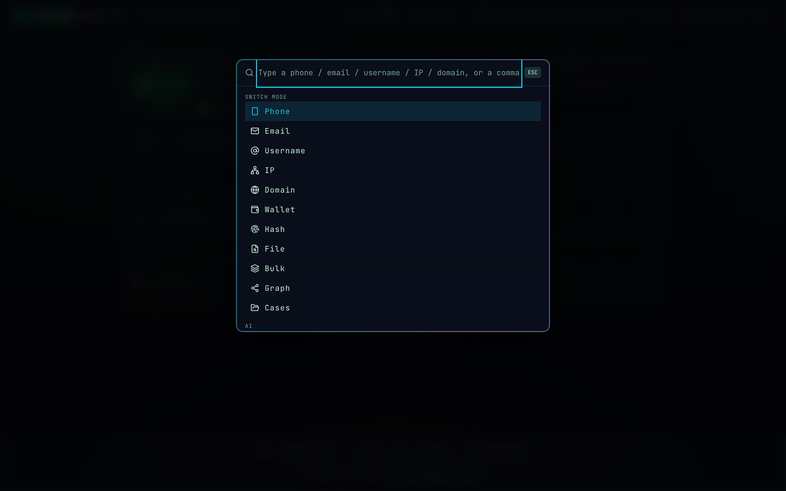
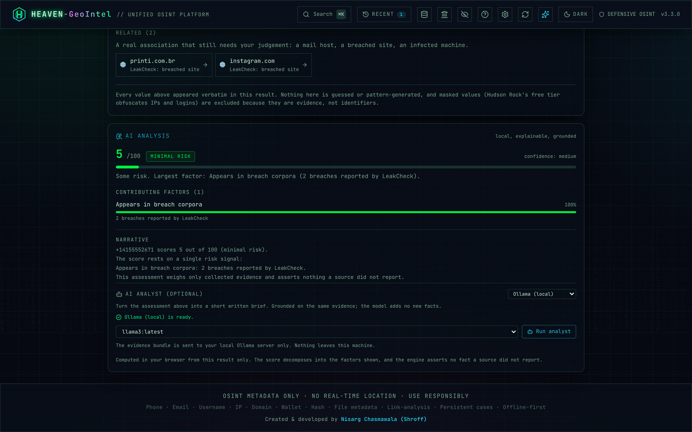

# 🛰️ HEAVEN-GeoIntel · Unified OSINT Platform

<p align="center">
  <picture>
    <source media="(prefers-color-scheme: light)" srcset="public/brand/poster-light.svg"/>
    <source media="(prefers-color-scheme: dark)" srcset="public/brand/poster.svg"/>
    
  </picture>
</p>

<p align="center">

</p>

<p align="center">

</p>

---

<div align="center">

  <p>
    
    
    
    
    
    
  </p>

  <p>
    
    
    
    
  </p>

  <p>
    
    
    
    
    
  </p>

  <p>
    <a href="https://github.com/nishu2402/HEAVEN-GeoIntel/stargazers"></a>
    <a href="https://github.com/nishu2402/HEAVEN-GeoIntel/network/members"></a>
    <a href="https://github.com/nishu2402/HEAVEN-GeoIntel/issues/new"></a>
  </p>

</div>

---

> ### ⚠️ Acceptable use
>
> **HEAVEN-GeoIntel returns publicly-derivable metadata only.** It does **not** and **cannot** provide real-time GPS, live device tracking, or SS7 interception.
>
> Use this tool only:
> - Within an **explicit, written penetration-test scope of work**.
> - For OSINT research, journalism, or protecting yourself / your family / your organisation.
> - In ways that comply with the laws of **both your jurisdiction and the target's**.
>
> Stalking, harassment, doxing, domestic abuse, and any non-consensual surveillance are **explicitly prohibited** by the [LICENSE](./LICENSE). Misuse is the sole responsibility of the user.

---

<a id="authors"></a>
## 👾 Authors

### Nisarg Chasmawala · Alias: **HEAVEN**

<div align="center">

| | Detail |
|---|---|
| 🔗 **LinkedIn** | [linkedin.com/in/nisarg-chasmawala](https://www.linkedin.com/in/nisarg-chasmawala) |
| 🐙 **GitHub** | [github.com/nishu2402](https://github.com/nishu2402) |
| 🎯 **Role** | Offensive Security Engineer · Penetration Tester · OSINT Analyst |

</div>

---

## 🖼️ Screenshots

<table>
  <tr>
    <td width="50%" align="center" valign="top">
      
      <br/><sub><b>Phone result.</b> Abuse and exposure scored the moment a number lands, each export format one click away, and every source that answered named underneath.</sub>
    </td>
    <td width="50%" align="center" valign="top">
      
      <br/><sub><b>OSINT pivots.</b> Thirty-seven reverse-lookup, messaging and spam links, filtered by access tier.</sub>
    </td>
  </tr>
  <tr>
    <td width="50%" align="center" valign="top">
      
      <br/><sub><b>Unified breach view.</b> One row per breach, merged across every source that answered, over the free no-key lookups.</sub>
    </td>
    <td width="50%" align="center" valign="top">
      
      <br/><sub><b>Number anatomy.</b> Country code, area code and subscriber digits broken out, with libphonenumber checks and standard formats.</sub>
    </td>
  </tr>
  <tr>
    <td width="50%" align="center" valign="top">
      
      <br/><sub><b>Command palette.</b> Press ⌘K to reach any of the eleven modes, from phone and email to wallet, hash and file metadata.</sub>
    </td>
    <td width="50%" align="center" valign="top">
      
      <br/><sub><b>Bulk mode.</b> Paste up to five hundred rows of any identifier, let <code>auto</code> classify each one, then export the table as CSV.</sub>
    </td>
  </tr>
  <tr>
    <td colspan="2" align="center" valign="top">
      
      <br/><sub><b>AI Analysis.</b> An explainable, grounded risk read-out for every finished lookup, with the score broken into the factors that produced it. Below it sits an optional, opt-in AI Analyst that turns the same evidence into a short brief and flags anything the model writes that the evidence did not support. It sets itself up in the panel: it detects a local Ollama server or a saved cloud key, selects one that works, and links straight to the provider's key console when neither is there.</sub>
    </td>
  </tr>
</table>

---

## 📋 Table of Contents

- [👾 Authors](#authors)
- [🧠 Project Summary](#project-summary)
- [💡 Core Idea](#core-idea)
- [🧭 The Workspace](#workspace)
- [🚀 Quick Start](#quick-start)
- [🐳 Docker Deployment](#docker-deployment)
- [📞 Phone Intelligence](#phone-intelligence)
- [📧 Email Intelligence](#email-intelligence)
- [🧑‍💻 Username Intelligence](#username-intelligence)
- [🌐 IP &amp; Domain Intelligence](#ip-domain-intelligence)
- [🪙 Wallet Intelligence](#wallet-intelligence)
- [🕸️ Link-Analysis Graph &amp; Cases](#graph-cases)
- [📄 Reports &amp; Exports](#reports)
- [≡ Bulk Mode](#bulk-mode)
- [🔑 Optional API Enrichment](#api-enrichment)
- [⚙️ How It Works](#how-it-works)
- [🎛️ Runtime configuration](#runtime-configuration)
- [🔌 REST API](#rest-api)
- [✅ Data Accuracy](#data-accuracy)
- [🔒 Security](#security)
- [🧪 Tests](#tests)
- [📁 Project Structure](#project-structure)
- [⚡ Tech Stack](#tech-stack)
- [⬡ The Mark](#the-mark)
- [📜 Available Scripts](#available-scripts)
- [🔧 Troubleshooting](#troubleshooting)
- [🤝 Contributing](#contributing)
- [⚠️ Disclaimer](#disclaimer)

---

<a id="project-summary"></a>
## 🧠 Project Summary

<p align="center">

</p>

**HEAVEN-GeoIntel** is a production-ready, unified OSINT intelligence platform for **phone numbers, email addresses, usernames, IP addresses, domains, crypto wallets and file hashes** (with file-metadata reading, a link-analysis graph and persistent investigation cases), built for penetration testers, security researchers and OSINT analysts. It returns real, actionable intelligence: no placeholders, no simulations, no fake data.

<div align="center">

| Metric | Value |
|---|---|
| 🎯 **Scope** | Phone · Email · Username · IP · Domain · Wallet · Hash · File metadata · Bulk · Link-graph · Persistent cases · Evidence locker |
| 🧭 **Workspace** | 11-mode unified console · ⌘K command palette · light/dark themes · 3D glass UI |
| 🔑 **Core Requirement** | Zero API keys; offline + free-source enrichment works out of the box |
| 📦 **Install** | One command: `bash scripts/start.sh` installs dependencies, seeds `.env.local`, builds and serves (or `npm install && npm run setup`). No database, no Python, no `requirements.txt`, no cloud account |
| 📞 **Phone OSINT** | Carrier · type · NPA geo · separate abuse-risk and exposure scores · pivots · QR · report export |
| 📧 **Email OSINT** | Breach (unified across XposedOrNot + LeakCheck, enriched offline from three vendored catalogs: HIBP, XposedOrNot and a Wikipedia notable-breaches tier) · password exposure (ProxyNova COMB, masked) · reputation · identity · validation · credential hashes |
| 🧑‍💻 **Username OSINT** | 38 sites checked in parallel, plus an on-request deep sweep of 242 more; identities fused only on proof (a self-link or a server-side perceptual avatar match), everything else labelled a candidate |
| 🌐 **IP / Domain OSINT** | IP geo + ASN + VPN/proxy flags · domain DNS + WHOIS + SPF/DMARC + subdomains from certificate transparency, reverse IP and passive DNS + port/CVE exposure on its own addresses + LEI + live security headers, TLS cert and tech fingerprint · internationalised names accepted in both spellings |
| 🦠 **Infostealer Exposure** | **Hudson Rock Cavalier**: free, no key, always-on, on **phone, email and username** |
| 💥 **Breach Intelligence** | **One unified, deduplicated view** merging XposedOrNot + LeakCheck (both free, no key) + BreachDirectory (RapidAPI). The headline count is the union across sources, not one source's share. Add an optional **Have I Been Pwned** API key and HIBP's own per-account breaches join the union, so the count can match HIBP directly (the free indexes only know a subset). Bare breach names are enriched offline from three vendored, keyless catalog snapshots (data classes, record counts, dates; no key, works offline): a rich credential tier of **HIBP + XposedOrNot** whose overlapping descriptions are unioned, plus a **Wikipedia notable-breaches tier** for large government and institutional incidents the credential indexes never carry, now browsable in-app as a searchable **Notable breaches** reference (the largest documented institutional breaches by size, keyless and offline). **ProxyNova COMB** adds masked password-exposure evidence with a reuse verdict. Plus 5 one-click free breach lookups |
| 🔀 **Cross-Identifier Auto-Pivot** | Every result offers the identifiers it derived as one-click lookups; confirmed links separated from related ones, nothing guessed |
| 🕸️ **Link-Analysis Graph** | Interactive SVG node graph · **derived links persisted server-side per case**, labelled with the source that produced them · PNG export |
| 🗂️ **Persistent Cases** | File-backed cases: identifiers, notes, derived graph, **snapshot history**; survive restarts · optional `CASE_PASSWORD` lock |
| 📈 **Change Tracking** | Re-run a pinned lookup and the tool reports exactly which facts moved: breach counts, open ports, subdomains. A **change inbox** collects every movement across every case, newest first, with an optional webhook |
| 📦 **Evidence Locker** | Preserve the response as the API returned it, SHA-256 it into a per-case manifest, and verify every artifact later |
| 🪙 **Wallet OSINT** | OFAC SDN screening against a bundled 1,056-address snapshot · BTC activity and counterparties · ERC-20 holdings · forward-verified ENS |
| ≡ **Bulk** | Up to 500 mixed identifiers, run as a real cancellable job with per-row provenance and CSV out |
| 🖥️ **Headless CLI** | `geointel domain example.com --json`, against the same API the console uses |
| 🗺️ **NPA Database** | 397 US/CA area codes → state · metro · timezone (offline) |
| 🌍 **Country Dataset** | 99 countries: capital · currency · languages · GDP · emergency numbers |
| ⚡ **Cache / Persistence** | 24 h in-memory cache (phone/email, FIFO evict, auto-invalidated when an API key changes) · file-backed cases |
| 🚦 **Rate Limiting** | 60 requests/minute **per client** + a server-wide ceiling; fixed-window, all limits env-tunable |
| 🔌 **REST API** | OpenAPI 3.1 spec at `/api/docs`, **generated from the route registry**, 30 operations across 21 endpoints |
| 🐳 **Container** | Multi-stage Dockerfile · `docker compose up -d` |
| 🧪 **CI / Tests** | Vitest with a 100% coverage gate on everything that ships · Playwright smoke suite · ESLint 9 · GitHub Actions on every PR · multi-arch ghcr image on push to `main` |
| 🏗️ **Stack** | Next.js 16 · TypeScript strict · Tailwind · Framer Motion · libphonenumber-js |
| 🎨 **UI Theme** | Hybrid cyberpunk glass: 3D tilt cards · neon glow · holographic borders · animated grid · Canvas katakana rain · **light + dark** · fully responsive |

</div>

---

<a id="core-idea"></a>
## 💡 Core Idea

<p align="center">

</p>

During a penetration test or OSINT investigation, analysts pivot by hand across 20-30 separate tools and browser tabs to build intelligence around a single identifier. HEAVEN-GeoIntel centralises that workflow into one console, and lets you **link the identifiers together**:

```
Target  ─►  phone │ email │ username │ IP │ domain │ wallet │ hash
        │
        ├─ Instant offline analysis    (libphonenumber-js · MCC/MNC · NPA · OFAC SDN · bundled datasets)
        ├─ Free no-key source fan-out   (Hudson Rock · XposedOrNot · Gravatar · ip-api · Cloudflare DoH ·
        │                                RDAP · Certspotter + crt.sh · passive DNS · reverse IP ·
        │                                Shodan · GreyNoise · GLEIF · 38 + 242 username sites)
        ├─ Optional API enrichment      (IPQualityScore · Twilio · Hunter.io · FullContact · BreachDirectory)
        ├─ OSINT pivot matrix           (37 phone links · 22 email links · tier-tagged · deduplicated)
        ├─ Link-analysis graph          (connect phone ⇄ email ⇄ username ⇄ IP ⇄ domain ⇄ wallet ⇄ hash)
        ├─ Persistent cases             (group identifiers across sessions · analyst notes · change inbox)
        ├─ Evidence locker              (the response as returned · SHA-256 · verify it months later)
        └─ Export                       (paged PDF · interactive .html · .txt · .md · STIX · CSV · graph PNG)
```

> **Scope:** Returns publicly derivable *metadata* only. Does **not** provide real-time GPS, live device tracking, SS7 interception, or any form of unauthorized surveillance.

---

<a id="workspace"></a>
## 🧭 The Workspace

<p align="center">

</p>

One unified console with an **11-mode switcher**. Seven are live lookups (phone, email, username, IP, domain, crypto wallet, file hash), File reads deep metadata from any file in your browser, and the last three are workflow tools.

<div align="center">

| Mode | What it does |
|---|---|
| 📡 **Phone** | Full phone OSINT: carrier, breach, infostealer, identity, pivots |
| ✉ **Email** | Full email OSINT: breach, reputation, identity, validation, pivots |
| @ **Username** | Check a handle across 38 sites in parallel (found / unverified), then a deep sweep of 242 more on request; proves which accounts belong to one person before it fuses them |
| ⦿ **IP** | Geo · ASN · ISP · reverse DNS · VPN/proxy/hosting flags · risk score |
| 🌐 **Domain** | DNS · WHOIS · SPF/DMARC posture · subdomains from three sources · passive DNS history · reverse IP · port and CVE exposure on its own addresses · legal entity (LEI) · HTTP header grade · TLS certificate · internationalised names · email permutations |
| 🪙 **Wallet** | Crypto address OSINT: OFAC sanctions screening against the bundled SDN list, BTC / ETH balance, transaction span and counterparties, ERC-20 holdings, forward-verified ENS name, explorer pivots |
| # **Hash** | File-hash reputation: CIRCL hashlookup known-software (NSRL) clearance + verdict-engine pivots, plus a local **Crypto Workbench** to hash, encode and encrypt/decrypt any text (MD5/SHA family, HMAC, Base64/hex/URL/binary/Morse/ROT13/Atbash, Caesar/Vigenère/XOR, and AES-256-GCM with a passphrase) offline in the browser, and a keyless **Pwned Passwords** check that tells you whether a password has ever leaked using k-anonymity, so only the first five characters of its SHA-1 hash ever leave the tab |
| 📄 **File** | Deep metadata from any file, parsed in your browser (the file is never uploaded): identifies ~70 formats by content, then reads each one properly. Photos give EXIF/GPS, IPTC byline and caption, XMP identifiers and camera serials; PNGs give their text chunks, including the prompt and seed an image generator wrote. PDFs give the author block, page count and size, save history, embedded fonts and active content; Office gives author, company, manager, revision and editing time from both the XML and the legacy OLE2 formats; archives give their member list, owners and risky paths; audio gives tags, bitrate and the Broadcast Wave originator; video gives its track list and device tags; executables give their build timestamp, toolchain and symbol paths; fonts, SQLite databases, packet captures, SVG, HTML, RTF and saved email each give their own. Every file also gets SHA-256/SHA-1, entropy and an extension-vs-content check, reverse-image pivots for images, and a full report export in five formats |
| ≡ **Bulk** | Triage up to 500 mixed identifiers of any type as a cancellable background job → CSV export |
| 🕸 **Graph** | Link-analysis graph of this session, or of any saved case, across all seven identifier kinds |
| 🗂 **Cases** | Persistent investigation cases: group identifiers, notes, per-case graph, a hashed evidence locker and a change inbox |

</div>

- **⌘K / Ctrl+K command palette**: type any identifier and it auto-detects the type and runs the lookup; jump between modes; toggle the theme. Powered by [`cmdk`](https://github.com/pacocoursey/cmdk).
- **Keyboard-first**: press `1`-`9` to switch mode, `/` to focus the input, `⌘K` for the palette. A `?` help button lists every mode and shortcut.
- **Example chips** under each empty input ("Try `+1 415 555 2671`…") so you're never staring at a blank box, and every lookup gets a shareable URL (`?mode=…&q=…`); bookmark or hand off any result, in any mode.
- **At-a-glance summary** at the top of a phone result (line type · carrier · location · breach · infostealer) plus a "jump to" nav, so you find the answer without scrolling 12 panels. Hover any acronym (E.164, NPA, CNAM…) for a plain-language tooltip.
- **Sources & keys panel**: one click shows which data sources are live, and lets you **add your optional API keys right in the app** (no editing `.env.local`). Keys are stored server-side (`.data/keys.json`, owner-only, git-ignored) and **never sent back to the browser**; the UI only ever sees a configured/not flag, so an empty field is self-explanatory.
- **Light + dark themes** + a **visual-effects toggle** that honours `prefers-reduced-motion`, a persisted toggle with an anti-flash boot script. The UI is a hybrid "cyberpunk glass" design: 3D parallax-tilt cards, neon glow, holographic borders, an animated grid backdrop, and the signature Canvas katakana rain (which respects reduced-motion and the toggle).
- **Session graph**: every successful lookup adds a node, so by the end of an investigation you have a visual map of how the identifiers connect (exportable as PNG).

---

<a id="quick-start"></a>
## 🚀 Quick Start

<p align="center">

</p>

### One-click deploy

[](https://vercel.com/new/clone?repository-url=https%3A%2F%2Fgithub.com%2Fnishu2402%2FHEAVEN-GeoIntel&project-name=heaven-geointel&repository-name=HEAVEN-GeoIntel)
[](https://railway.com/new)
[](https://render.com/deploy)

Or pull the pre-built container:

```bash
docker run -d --name geointel -p 127.0.0.1:3000:3000 ghcr.io/nishu2402/heaven-geointel:latest
```

### Requirements

- **Node.js 20.9 or higher**: [nodejs.org](https://nodejs.org) (Next.js 16 requires Node 20.9+; the bundled [`.nvmrc`](./.nvmrc) pins v22, the active LTS the project is tested on)
- **npm 10 or higher**: included with Node.js 20+
- No database, no Redis, no cloud account required. Docker is **optional**; see the [Docker section](#docker-deployment) if you prefer a container.

```bash
node -v   # must be v20.9.0 or higher
npm -v    # must be 10.0.0 or higher
```

### Clone & install

```bash
git clone https://github.com/nishu2402/HEAVEN-GeoIntel.git
cd HEAVEN-GeoIntel
npm install
```

> No Git installed? Install it from [git-scm.com](https://git-scm.com), or download the project as a ZIP (**Code → Download ZIP**) and extract it.
>
> **Moving the project to another PC?** Do **not** copy `node_modules`; it contains OS-specific binaries. Copy only the source, then run `npm install` fresh.

### One-command start

One command does the whole thing. On a fresh clone the launcher installs
dependencies, seeds `.env.local`, builds the production bundle, and serves the
app, so the `npm install` step above is optional: it runs for you whenever
`node_modules` is missing.

```bash
bash scripts/start.sh        # installs on first run, builds, serves on your LAN, self-tests
bash scripts/start.sh --dev  # hot-reload dev server (local only)
# or
npm run setup                # npm equivalent of dev mode
```

The default (production) mode builds the app and serves it bound to all
interfaces, then **self-tests** both the Local and Network URLs and prints the
result. Dev mode is for local hot-reload only; Next 16's dev server blocks
cross-origin requests to its internals, so it is **not** reachable from other
devices.

### Open it on your phone (same Wi-Fi)

`bash scripts/start.sh` prints a **Network** URL like `http://192.168.1.42:3000`
and verifies it is reachable. Open **that exact URL** on your phone, **never
`0.0.0.0`** (that is what Next's own banner prints; it means "all interfaces",
not an address a phone can open).

If your phone still can't load it, the server is fine and the block is your
network. Diagnose it:

```bash
bash scripts/start.sh --doctor   # checks firewall, VPN, interface, AP isolation
npm run doctor                   # same
```

The two usual causes: the phone is on a different Wi-Fi/Guest network, or the
router has **"AP isolation" / "client isolation"** turned on (toggle it off in
the router settings). macOS may also prompt once to allow `node` to accept
incoming connections; click **Allow**.

### Global command

The first time you run `bash scripts/start.sh`, a `geointel` shell function is auto-registered in your shell config (`~/.zshrc`, or `~/.bashrc`). Open a new terminal (or `source` it) and type `geointel` from anywhere to start the app. Register/re-register manually with `npm run install-global`; skip auto-registration with `NO_GLOBAL=1 bash scripts/start.sh`. `geointel --help` lists the flags.

### Uninstall

```bash
npm run uninstall-global
```

Removes the `geointel` command in every form it can be installed: the
`/usr/local/bin` shim (with `sudo` if it's root-owned) and the function block in
any of your shell RC files, including entries left by older versions. It writes
a one-time `.geointel-bak` backup of each RC file it edits, and it is idempotent.

**Your data is not touched by default.** Investigation cases, the audit log and
any API keys you saved in the UI stay in `.data/`. To delete those too:

```bash
npm run uninstall-global -- --purge-data
```

It prints exactly what it is about to delete (including how many cases) and
requires you to type `yes`. Non-interactively it refuses unless you also pass
`--yes`. `.env.local`, `node_modules` and the build output are never removed;
delete the project folder when you want those gone.

### Headless: the same tool in a shell

`geointel` used to start the web app and nothing else, so every lookup had to go through a browser. That rules the tool out of the place a lot of OSINT work actually happens: a shell, a pipeline, a cron job, a list of targets and `jq`.

```bash
geointel domain example.com --json | jq '.subdomains'
geointel email someone@example.com                   # readable summary
geointel username torvalds --json | jq '.resolvedIdentity.confidence'
geointel bulk targets.txt --csv > triage.csv         # or: cat list | geointel bulk -
```

It reimplements nothing. It talks to the same HTTP API the console uses, so a CLI answer and a browser answer come from identical code. If an instance is already running it is reused; otherwise one is started on a private port, used, and shut down. `--server URL` points it at an instance running somewhere else, `--json` prints the raw response, `--timeout MS` sets the per-request budget, and `bulk` takes `--mode` and `--csv`. Exit codes are `0` for a lookup that answered, `1` for one that failed, `2` for bad usage, so it composes in a script.

Every flag `geointel` already understood (starting the app, `--help`, the installer) still works: a first argument that names a mode goes to the CLI, anything else starts the console as before.

### Security & operations (optional)

| Want to… | Do this |
|---|---|
| **Require a login** before the app/API (e.g. when exposing it on a LAN) | set `AUTH_PASSWORD` (and optionally `AUTH_USER`, default `analyst`); enables HTTP Basic auth on everything except `/api/health`. Off by default. |
| **Reach it through a domain name** without a login (e.g. `osint.example.com`, a Tailscale `*.ts.net` name) | set `ALLOWED_HOSTS=osint.example.com` (comma-separated, `*.` matches subdomains). Without a password the app answers **421** to any other domain in the `Host` header, which is what stops a DNS-rebinding page from reading your cases. IP addresses, `localhost`, bare machine names and `.local` names always work. |
| **Keep an audit trail** of lookups | automatic; `.data/audit.log` records type · **hashed** target · time · status. Set `AUDIT_PLAINTEXT=1` to store raw targets. |
| **Health-check** the service | `GET /api/health` → `{ status: "ok", … }` (also the Docker healthcheck). |
| **Wipe everything** (cases + audit log) | the **WIPE ALL** button in the Cases tab, or `curl -X DELETE '<host>/api/cases?all=1'`. |
| **Export / hand off a case** | Cases tab → **PDF** (paged dossier with a cover sheet and a signature block), **HTML** (interactive dossier), **JSON** (re-importable, SHA-256 integrity-hashed), **REPORT** (Markdown), CSV, STIX or Maltego. Re-import verifies the hash and warns on tampering. |

Persistent data lives in `.data/` (`cases.json`, `audit.log`), written owner-only (`0600`) and git-ignored.

---

<a id="docker-deployment"></a>
## 🐳 Docker Deployment

<p align="center">

</p>

A multi-stage `Dockerfile` and `docker-compose.yml` ship with the repo. The runtime image is **~205 MB compressed (~1 GB on disk)**, runs as a non-root user, and reads optional API keys from your `.env.local` at start-up, starting fine without one, since every key is optional.

Compose publishes on **127.0.0.1 only**, so the console is not exposed to your network by default. Both sides of the mapping are overridable without editing any file: `GEOINTEL_BIND=0.0.0.0 docker compose up -d` to expose it, `GEOINTEL_PORT=8080` for a different host port.

```bash
# Compose (build + start in the background)
docker compose up -d
open http://localhost:3000          # macOS (Linux: xdg-open, Windows: start)

# Plain Docker (no compose)
docker build -t heaven-geointel:3.3.0 .
docker run --rm -p 127.0.0.1:3000:3000 heaven-geointel:3.3.0

# …with API keys (omit --env-file entirely if you have no .env.local;
# docker run fails on a missing env file, it does not skip it)
docker run --rm -p 127.0.0.1:3000:3000 --env-file .env.local heaven-geointel:3.3.0
```

<div align="center">

| Layer | Purpose | Size impact |
|---|---|---|
| `deps`    | `npm ci` against a frozen `package-lock.json` | cache-friendly |
| `builder` | `next build`, emits the production bundle  | discarded |
| `runner`  | `node:22-alpine` + non-root user + `next start` | ~205 MB compressed |

</div>

**Tips.** Update API keys: edit `.env.local` then `docker compose restart`. Custom host port: `GEOINTEL_PORT=8080 docker compose up -d`; do **not** set `PORT`, which moves the port the app listens on while the published mapping stays at 3000, leaving a container that starts cleanly and answers nothing (compose pins `PORT=3000` to prevent exactly that). Expose beyond localhost: `GEOINTEL_BIND=0.0.0.0 docker compose up -d`. Compose reads both variables from your shell or a `.env` file in the repo root, **not** from `.env.local`, which is only forwarded into the container. Cases, in-app API keys and the audit log live in the `geointel-data` volume, so they survive `docker compose up --build`; with plain `docker run`, add `-v geointel-data:/app/.data` to keep them. Logs: `docker compose logs -f geointel`. The image's own `HEALTHCHECK` polls [`/api/health`](#rest-api), a local-only endpoint that makes no third-party calls, and shows the container as `(healthy)` about 20 s after start. In production, terminate TLS in your nginx/Caddy/Traefik and proxy to `localhost:3000` (the default loopback binding is what you want there).

---

<a id="phone-intelligence"></a>
## 📞 Phone Intelligence

<p align="center">

</p>

Every phone lookup returns real data derived from the number structure and bundled datasets; no simulation, no placeholders.

<div align="center">

| Panel | What It Shows |
|---|---|
| **Result Header** | E.164 · country flag · validity · two separate 0-100 figures, **Abuse Risk** and **Exposure**, each with its own colour-coded label and the signals behind it |
| **Identity / Owner Profile** | Real name · employer · social profiles (FullContact). With no key, it points you to the **OSINT Pivot Matrix**: one deduplicated set of reverse-lookup links (no repeated or dead links). |
| **Credential Breach Search** | BreachDirectory password-hash hits (with key) + 5 always-on **one-click free breach lookups** (HaveIBeenPwned · IntelligenceX · Dehashed · LeakCheck · Snusbase). |
| **Infostealer Malware Exposure** | Hudson Rock, **no key**. Every infected device that captured the number, paired credential samples, captured sites, malware family (only when identifiable, never a dropper filename passed off as a family), OS, capture date. |
| **Public Breach Index** | LeakCheck, **no key**. How many indexed records mention the number, which field types were exposed, and the named breaches. Exposure metadata only; the public tier returns no credentials. |
| **Phone OSINT Intelligence** | Intelligence Score · Target Profile classifier · Attack-Vector grid (Vishing/Smishing/SIM-Swap/Spoofing/Pretexting/Location) · live local time · call window · NPA intel · offline signals |
| **Location Intelligence** | Country · state/province · metro · city · area code · timezone + UTC offset |
| **Country Intelligence** | Capital · continent · region · population · currency · languages · driving side · emergency number · GDP per capita |
| **Number Anatomy** | One consolidated panel: visual digit breakdown · line type + description · libphonenumber validity checks · all four formats (E.164 / International / National / RFC 3966) |
| **SIM & Carrier Intel** | Owner/CNAM · carrier (incl. offline MCC/MNC → operator) · prepaid · active status · MCC/MNC/PLMN · associated emails |
| **Number Permutations** | 12 format variants for OSINT/database searching |
| **OSINT Pivots** | 37 links across 5 categories, each tagged **FREE / CAPTCHA / APP / LOGIN / PAID / BLOCKED**; filter chips default to FREE + CAPTCHA + APP. Every link takes the number directly, with no dead "did not match any documents" results |
| **QR Code** | Canvas-rendered QR for the `tel:` URI · downloadable as PNG |
| **Report Export** | One report model, five formats, and **two different documents** for PDF and HTML: the PDF is a paged A4 file (cover sheet, document-control block, numbered sections, ruled tables, print-legible ink) and the HTML is an interactive dossier in the app's own palette (sticky contents rail, live filtering, per-value copy). Plus `.txt`, Markdown and a STIX 2.1 bundle. Every format carries the same executive summary, grounded AI risk assessment, evidence sections, per-source outcome, methodology, legend and collection statistics. See [Reports](#reports-two-documents-not-one-file-offered-twice) |
| **History Drawer** | Last 20 lookups (browser localStorage) |
| **Shareable URL** | `?q=+14155552671` auto-runs the lookup |

</div>

### One number could not answer two questions

A single "threat score" conflated two different findings. A number that appears in four breaches and a number used by a scam call centre both scored high, and the label said the same thing about both. The White House switchboard, a public number in public breach indexes, read as a threat.

So there are two figures, and each says what it is:

| Figure | The question it answers | What moves it |
|---|---|---|
| **Abuse risk** | Is this identifier being used against people? | Reputation verdicts from sources that actually make them: blacklisted, malicious, spam, known-fraud, disposable |
| **Exposure** | How much of this identifier is already public? | Named breaches, credential records recovered, infostealer captures, a source stating outright that credentials leaked |

Exposure is evidence volume, not danger, and its bands say so (`NONE OBSERVED`, `LIMITED`, `SIGNIFICANT`, `EXTENSIVE`) rather than borrowing the language of risk. The White House switchboard now reads **abuse 0 CLEAN** with **exposure 46 SIGNIFICANT**, which is the truthful pair of statements. Both figures are computed locally, and each lists the signals that produced it.

### Phone OSINT Pivots: 37 links, 5 categories

One **single, deduplicated** link matrix: every service appears exactly once, every link takes the number directly to a results page. Breach lookups live in the dedicated Breach panel, not here.

The **BLOCKED** tier is hidden by default and means something narrower than it looks. Four US people-search sites refused an ordinary Chrome session outright, with no challenge to solve, measured from a residential line outside the US. That rules out the usual explanation, since the address was already residential, and leaves the visitor's country untested. So the badge claims only what was seen: each blocked row says on its face that this was one address on one day, not a property of the site, and the chip is there so you can try it from yours.

<div align="center">

| Category | Count | Default tier |
|---|---|---|
| **Identity / Reverse Lookup** | 17 | FREE first, login/paid/blocked behind filter chips |
| **Messaging: Is it Registered?** | 6 | all FREE |
| **Spam / Abuse Reports** | 6 | all FREE |
| **Carrier / HLR / Telecom** | 3 | mix of FREE / CAPTCHA / PAID |
| **Search Engines (broad)** | 5 | all FREE |

</div>

### Accepted formats

```
+14155552671          # E.164 (recommended)        +91 98765 43210   # Indian
+44 7911 123456       # International with spaces   001 (415) 555-2671 # US with IDD prefix
```

---

<a id="email-intelligence"></a>
## 📧 Email Intelligence

<p align="center">

</p>

Every email lookup runs offline analysis instantly, then fans out to free data sources in parallel.

<div align="center">

| Panel | What It Shows |
|---|---|
| **Identity Header** | Confirmed name (FullContact → Gravatar → inferred) · avatar · job title · employer · location · bio · threat-score bar |
| **Abuse Risk / Exposure** | Two figures, not one. Abuse risk reads the reputation signals (blacklisted, malicious, spam, disposable); exposure reads how much of the address is already public (named breaches, credential records, infostealer captures) |
| **FullContact Enrichment** | Real name · age · gender · social profiles · linked emails & phones · employment history (optional key) |
| **Breach Database** | XposedOrNot: 1000+ databases, no key. Per-breach: name · year · records · exposed data types · password-risk level (Plaintext / Easy-Crack / Hashed) |
| **Credential Hashes** | BreachDirectory: real SHA-1/MD5 hashes with one-click crack buttons (CrackStation · Hashes.com), optional RapidAPI key |
| **Email Classification** | Provider type (corporate/free/disposable/privacy/gov/edu) · disposable detection (1,200+ domains) · free-webmail (370+) · privacy hosts (70+) · role-address detection |
| **Mail Exchange (keyless)** | Cloudflare DoH MX lookup: names where the domain's mail lands (Google Workspace · Microsoft 365 · Proofpoint · Mimecast · Zoho · Proton · self-managed …) · corroborates the domain, never claims the address is valid · no key |
| **Reputation** | EmailRep.io: suspicious · blacklisted · malicious · credentials leaked · spam · first/last seen · registered platforms |
| **Validation / Deliverability** | AbstractAPI (SMTP/MX, quality, catch-all) · Hunter.io (deliverable/risky/undeliverable + confidence) |
| **OSINT Matrix** | 26 investigation links across 4 categories |
| **Report Export** | The same unified report as every other mode (paged PDF · interactive `.html` · `.txt` · Markdown · STIX 2.1), including the mail-exchange fingerprint, the breach list by name and the credential-exposure block |

</div>

### Accepted formats

```
user@domain.com   ·   first.last@corporate.org   ·   user+tag@provider.net
```

---

<a id="username-intelligence"></a>
## 🧑‍💻 Username Intelligence

<p align="center">

</p>

Enter a handle and HEAVEN-GeoIntel checks **38 sites** for it. **23 are auto-verified server-side** (so no CORS limits) and marked **FOUND** or **UNVERIFIED**. The other **15 are JS apps or bot-walls that answer for *every* username, or anti-bot challenges that block a keyless server fetch** (Instagram, TikTok, Telegram, npm, …); a server probe genuinely can't tell if the handle exists there, so the tool **never guesses**: it flags them **VERIFY →** as one-click links you open to confirm. That's the difference between this and tools that proudly report "found on 40 sites"; most of those are false positives.

Alongside the sweep, **nine platforms are read through their own keyless public API**, which upgrades "the account exists" to "here is who it is": GitHub, GitLab, Codeberg, Hacker News, Reddit, Bluesky, Mastodon, Chess.com and Lichess return a real name, join date, location, follower counts and bio. Two of them hand you a cross-platform edge for free: Chess.com reports a streamer's `twitch_url`, and Codeberg a self-declared website. Every one was promoted only after a clean split across 4 known-real and 4 known-absent handles; npm, Hacker News search and GitLab's user endpoint were tested and rejected for answering 200 to handles that do not exist.

How many handles you test a site with changes the answer. Testing one real handle against one fake one made Kaggle, Last.fm and Telegram all look auto-verifiable; re-running across eight known-real and six known-absent handles showed Kaggle returns 200 for absent handles too, while Last.fm and Telegram report real accounts as missing. Only X/Twitter survived that wider test, so only X/Twitter was promoted. It is probed only for handles X can actually hold (1-15 letters, digits and underscores): x.com serves a 200 page for anything else, so `john.doe` or `john-doe` is reported not found there rather than claimed.

<div align="center">

| Category | Example sites |
|---|---|
| **Developer** | GitHub · GitLab · Replit · Docker Hub · PyPI · npm · CodePen · Kaggle · Codeberg |
| **Social** | Instagram · X/Twitter · TikTok · Reddit · Telegram · Threads · Mastodon · Bluesky · VK · Pinterest |
| **Creative / Media** | YouTube · SoundCloud · Spotify · Behance · Dribbble · DeviantArt · Flickr · Vimeo · Medium · Patreon |
| **Gaming** | Twitch · Steam · Xbox · Chess.com · Lichess · Roblox · itch.io |
| **Professional / Forum** | Keybase · About.me · Gravatar · Linktree · Product Hunt · Wattpad · Last.fm · Trello · Hacker News |

</div>

- A **presence score** summarises how many sites the handle appears on.
- Pivot links (WhatsMyName · Sherlock · IntelligenceX · broad Google sweep) for deeper enumeration.
- Free · no API key · validated input (`[A-Za-z0-9._-]`, 2-40 chars).

### The deep sweep: 242 more sites, on request

The 38-site sweep is the fast answer. Behind a button sits the wide one: the bundled WhatsMyName catalog, read for its **detection contract** rather than its URL list.

A contract is four fields the catalog records for each site: the status and body string that mean *account exists*, and the status and body string that mean *account free*. A probe is only classified when the response matches one of those two pairs; anything else is reported `unknown` rather than folded into either answer. The catalog previously contributed nothing but links, because the contract was never read.

- **242 sites** are swept by default: the ones that behaved exactly as their contract documents when the catalog was last validated against a known-real and a known-absent handle.
- **392 more** are one checkbox away. They are offered rather than dropped, because a marker can rot and a site that failed from this machine may answer from yours.
- Measured on `bagder`, one 60-site page classified **56 of 60** either way: 7 confirmed accounts, 49 confirmed free, 4 unknown.

It is paged, explicitly started and stoppable, for one reason: hundreds of probes is tens of seconds and hundreds of sockets, so folding it into every username lookup would make the fast answer slow. The fan-out is bounded and requests to one host are serialised, so three WordPress.com rows are three sequential probes rather than three simultaneous ones.

### Identity resolution: proven, or a candidate

A shared handle is not evidence. Dozens of people claim a popular name on dozens of platforms; that is the base rate, not an anomaly. Looking up `torvalds` used to present "Portland, OR" (GitHub), "GT" (Chess.com) and "Bern" (Lichess) as one person's locations.

So a link now has to be **proven**, and there are exactly two proofs this tool can obtain without a key:

| Proof | What it is |
|---|---|
| **self-link** | One profile publicly points at the other: a website field holding `github.com/<their handle>`, a bio linking their Mastodon. The subject asserted the connection. |
| **avatar** | The same photograph on both, established by perceptual hash rather than by filename or URL. |

Avatar matching runs **server-side**, which is what makes it work at all: the browser cannot read pixels from another origin's image, so the old client-side comparison could never have produced a match. Each avatar is fetched through the same SSRF guard as every other outbound request, decoded (PNG and JPEG, with no native dependency), reduced to a 9x8 grey grid and hashed by row-wise gradient. Distance is Hamming distance over that hash, and known placeholder art (the Gravatar default, an identicon, a lettered initial) is recognised and never used as a link: identical default avatars prove nothing.

What you get back is a resolved identity with a **confidence** and the proofs it rests on, plus what it deliberately did not merge:

- `bagder` fuses GitHub and Mastodon on a 100% avatar match and resolves at **86**.
- `torvalds` finds no proof, so it is labelled a **candidate**, capped at **40**, and the Chess.com and Lichess locations are listed separately as unlinked candidates rather than absorbed.
- Where two proven-linked accounts disagree on a name or a location, the contradiction is printed as a contradiction instead of being averaged away.

---

<a id="ip-domain-intelligence"></a>
## 🌐 IP &amp; Domain Intelligence

<p align="center">

</p>

Both are **free, no-key**, and validate input before any outbound request.

### ⦿ IP intelligence (`ip-api` → `ipwho.is` · Shodan InternetDB · GreyNoise)

| Section | Fields |
|---|---|
| **Geolocation** | City · region · country · continent · postal · lat/lon · timezone + UTC offset · OpenStreetMap link |
| **Network / ASN** | ASN · AS org · ISP · organisation · reverse DNS (PTR) |
| **Internet exposure** | Open ports · known CVEs (linked to NVD) · hostnames · classifier tags; Shodan InternetDB, free |
| **Risk flags** | VPN/proxy · hosting/datacenter · mobile · Tor · GreyNoise classification, folded into a 0-100 IP-risk score |
| **Pivots** | Shodan · Censys · AbuseIPDB · VirusTotal · GreyNoise · IPinfo · Spur · BGP.he.net · Google sweep |

Accepts IPv4 and IPv6.

Geolocation has two providers because it needs one. ip-api.com's free tier is
45 requests per minute per source IP; when that runs out (or the host is down),
`ipwho.is` answers instead, on an unrelated quota. The tool tracks what each
provider reports about its own budget and stops calling one that has none left,
which is what keeps a one-minute throttle from escalating into the hour-long ban
providers hand out for sustained over-limit traffic. `ipwho.is` publishes no
proxy/hosting/mobile flags, so those come back `null` rather than a fabricated
`false`, and the source strip always says which provider answered.

### 🌐 Domain intelligence (DNS-over-HTTPS · RDAP · Certspotter · live HTTP/TLS)

| Section | Source |
|---|---|
| **DNS records** | A · AAAA · MX · NS · CNAME · TXT, via Cloudflare DNS-over-HTTPS |
| **Email-security posture** | SPF present? · DMARC policy (none/quarantine/reject) · MX present? A domain publishing an RFC 7505 null MX is reported as accepting no mail, which is its own declaration and not the same finding as publishing no exchanger. A check whose DNS query gets no answer is shown as unknown, never as missing |
| **WHOIS** | Registrar · created / updated / expires · nameservers · status, via RDAP (no key) |
| **Subdomains** | Three sources merged: certificate transparency (Certspotter **and** crt.sh, both always consulted), reverse IP, and passive DNS; up to 250, with the first 40 resolved to live addresses |
| **HTTP posture** | Security-header grade (A-F) · redirect chain · http→https upgrade · technology fingerprint · version-disclosing headers · cookie flags |
| **TLS certificate** | Protocol · cipher · issuer · SAN list · expiry countdown · chain-trust result · the CA-verified organisation on an OV/EV certificate |
| **Passive DNS** | What the name used to resolve to, with first and last seen per pair, via Mnemonic (keyless) |
| **Reverse IP** | Every host the source has seen on the apex address, via HackerTarget (keyless) |
| **Host exposure** | Open ports and known CVEs on the domain's own addresses, via Shodan InternetDB and GreyNoise |
| **Legal entity** | The LEI record for the registrant, or for the organisation the CA verified, via GLEIF (keyless) |
| **Email permutations** | Name + domain → 17 ranked address patterns, or the org's actual rule from one known address |
| **Pivots** | crt.sh · SecurityTrails · VirusTotal · Shodan · URLScan · Wayback · DNSDumpster · MXToolbox · SSL Labs · Wappalyzer |

Accepts bare domains or full URLs (scheme/path/`www.` are stripped automatically).

#### Subdomains: three sources, and what each one found

Coverage used to be one question with one answer. Certspotter's free issuances API returns roughly the hundred most recent certificates, and crt.sh was only consulted when Certspotter came back with fewer than five hosts. On `wordpress.org`, Certspotter's window held **9** hosts, so the threshold was never crossed, while crt.sh held **25**. The tool reported 9 as though that were the answer.

Now both CT sources always run, in parallel, and two more sources join them: reverse IP contributes the names sharing the apex address, and passive DNS contributes every name beneath the apex it has ever recorded (on `wordpress.org`, 194 of 200 returned rows were for a subdomain rather than the apex). The panel prints a **coverage strip**: each source, whether it answered, and how many hosts it contributed, so a thin result reads as a thin source rather than as a small attack surface. Measured end to end, `wordpress.org` went from 9 hosts to **494 distinct**.

The first 40 are then resolved, so a name from certificate transparency that no longer points anywhere is visibly dead rather than silently listed. A third-party domain that merely shares the server is reported separately as co-hosting, because that is a different finding from a subdomain of the name you asked about.

#### Passive DNS, and reading a degraded answer as degraded

Live DNS says what a name resolves to now. Passive DNS says what it used to, which is the half an investigation usually turns on: when the mail exchanger changed, which address the phishing host sat on last month.

Mnemonic's anonymous tier sometimes answers with **flattened** rows: every timestamp zeroed and every record type reported as `A`, including rows whose answer is plainly an IPv6 address. Measured on the same domain seconds apart, `limit=50` and `limit=100` returned full rows while `limit=25` and `limit=200` came back flattened, so it is a property of the response rather than of the request. A flattened row is not merely thin, it is wrong: an AAAA observation labelled A is a false statement about the record. The tool detects that shape, retries once, and if it persists keeps a type only where the answer itself proves it, marking the rest `UNKNOWN` and telling the panel the answer was degraded.

HackerTarget's failure mode is plain text in the body, so "API count exceeded" would parse as a hostname. Every line has to survive hostname validation, and a quota notice parks the source for an hour instead of being read as data.

#### Exposure on the domain's own addresses

The tool already knew how to ask what is exposed on a host. It just never asked it about the host it had resolved thirty lines earlier, so a domain lookup could not tell you that its own web server has an open Redis port. The apex addresses (at most three, so a round-robin A set cannot turn one lookup into a dozen calls) now go through the same keyless Shodan InternetDB and GreyNoise path the IP mode uses. On `münchen.de` that returns ports 80 and 443 and four CVEs on the apex address.

#### Who legally owns it

GDPR redacted the registrant out of most gTLD WHOIS records. What survived is the **organisation on an OV or EV certificate**, which a CA actually verified, and that is a name the Global LEI Foundation's register can be queried with, keylessly.

So the LEI lookup runs on the WHOIS registrant when there is one and on the certificate organisation when there is not, and the answer says which it used. `paypal.com` has no registrant in RDAP and an OV certificate reading "PayPal, Inc.", which resolves to LEI `LBQ3CAGQB6M55WHL3G85`. The register does word matching, so "PayPal, Inc." alone returns 76,760 hits; only an exact normalised name match is reported as the entity, and the rest are offered as candidates.

#### Internationalised names

`münchen.de` used to be rejected as invalid while its punycode spelling sailed through, which is backwards for OSINT: IDN and homoglyph abuse is a large share of real phishing, and the analyst pasting the name as it appears in the mail is the one to serve first.

Every domain-shaped input is now normalised once, to its ASCII A-label form, using the platform's own UTS-46 implementation rather than a hand-rolled table, and displayed in both spellings. Email addresses are handled the same way, with the local part left exactly as typed. The reverse direction matters for reading: `xn--80ak6aa92e.com` tells you nothing and `аpple.com` tells you everything, so A-labels are decoded for display, and a label that will not decode is shown exactly as it arrived rather than guessed at.

The look-alike generator gained the matching half: Cyrillic, Greek and Armenian homoglyph variants, each carrying both spellings, the punycode name to resolve and the Unicode name a victim sees.

#### Look-alike domains, resolved

The typosquat panel used to generate candidates and stop. **Resolve every look-alike** now runs the list through DNS and reports which ones answer, which have mail, and how old they are: a name registered days ago is a live campaign, one registered in 2009 is usually a brand holding its own defensive names. Unanswered queries are retried once, because a burst at this concurrency draws throttling from the resolver, and an unanswered candidate is a hole in the scan rather than a result.

#### The security-header grade

Seven headers on a weighted 100-point scale. The weights are uneven on purpose:
HSTS and CSP change what an attacker can actually do, so they carry 20 points
each; frame protection and `nosniff` close specific known classes at 15;
Referrer-Policy, Permissions-Policy and COOP are hygiene at 10. A site scoring in
the 60s has the structural controls and is missing the hygiene ones, a
materially different report from the reverse.

The grade describes what the headers say, never how safe the site is. `max-age=0`
is reported as HSTS switched **off** rather than present, a Report-Only CSP is
reported as **not** enforcing, and `X-Frame-Options: ALLOW-FROM` is called out as
a value browsers stopped honouring.

#### Only this probe touches the target

Every other domain source asks a third party. This one connects to the host you
typed, so it is gated by an SSRF guard: the addresses already resolved by the DNS
fanout must **all** be globally routable, and so must every address this
machine's own resolver gives for the name, or the probe does not run.
`localtest.me` and `1.0.0.127.nip.io` resolve to 127.0.0.1 while passing every
syntactic domain check, and cloud metadata lives at 169.254.169.254. Requiring
every address, not merely one, means a split-horizon name is refused rather than
raced. Each redirect hop is resolved and checked the same way before it is
fetched, so a public site cannot bounce the probe to `instance-data` or a
router's `.lan` name. The subdomain-takeover check, avatar downloads and the
username probes use the same guard.

This does not close a DNS-rebinding race. If you expose this tool to untrusted
users, egress-filter the container as well.

#### Email permutations are candidates, not findings

Nothing is checked against a mail server. SMTP callback verification is
unreliable (catch-all domains accept everything, greylisting rejects everything)
and noisy against a live target, so the panel produces a list to test elsewhere
and says so. Where one name cannot distinguish two patterns (`sam.sam@x.com`
fits `first.last` and `last.first` identically), both are reported rather than
one being picked.

---

<a id="wallet-intelligence"></a>
## 🪙 Wallet Intelligence

<p align="center">

</p>

### Sanctions screening, offline and first

The first question anyone asks about a crypto address is whether it is sanctioned, and the tool could not answer it.

A snapshot of the **US Treasury's SDN list** now ships with the app: **1,056 addresses across 20 chains** (532 Bitcoin, 254 Tron, 120 Ethereum, 94 USDT and the rest), read from the XML export rather than the CSV, whose remarks column is truncated and loses half the addresses. Like the breach catalogs it is offline by design: no key, no network call at lookup time, and no rate limit between an analyst and a sanctions answer.

The screen runs **before** the balance lookup and reports the designated entity, OFAC's own entry id and the programs it is listed under, so a hit can be traced back to the list. It answers even for chains whose balance this tool cannot read: a listed Tron address returns the sanctions match plus a plain statement that the balance is not something it can fetch, rather than a generic failure.

The scope is stated rather than implied: this is the SDN list only. A negative result means *not on this list*, never *clean*. Other authorities publish their own lists, and an address one hop from a listed one is not itself listed.

```bash
npm run sanctions:refresh    # re-vendor the snapshot from Treasury
```

### What else the address has been doing

| | |
|---|---|
| **Bitcoin activity** | First and last transaction seen in the sampled page, how many transactions were sampled, distinct counterparty addresses, and whether the address has more history than the sample covers |
| **Ethereum holdings** | ERC-20 balances for ten assets that carry value in an investigation (USDT, USDC, DAI, WETH, WBTC, stETH, LINK, UNI, SHIB, PEPE), read straight from a keyless public RPC. A zero balance is simply not reported |
| **Identity** | Forward-verified ENS name: the reverse record is resolved and then confirmed forward, so a self-declared name that does not point back is not printed as the owner |

The token list is deliberately fixed and short. There is no keyless way to enumerate every token an address holds, and pretending otherwise would mean either a paid indexer or a made-up answer.

---

<a id="graph-cases"></a>
## 🕸️ Link-Analysis Graph &amp; Persistent Cases

<p align="center">

</p>

### Session link graph

Every successful lookup (phone, email, username, IP, domain) adds a colour-coded node to an interactive SVG graph, connected to a central **TARGET**. Hover to highlight, and **export the whole chart as a PNG** for your report. It turns a session of scattered lookups into one visual map of how the identifiers relate.

### Derived links: what was inferred from what

Pinning a result to a case also stores the **relationships the auto-pivot engine derived**, each labelled with the source that produced it (`Gravatar: linked github account`, `DNS: MX host`, `Hudson Rock: credential captured on the same machine`). Those are drawn as dashed edges *between* real nodes, on top of the membership spokes, so the graph shows the derivation, not just the roster.

Only links whose **both** ends were actually pinned are stored, so the graph can never contain a node the case doesn't.

### Investigation cases (persistent)

- Create named **cases** and add any identifiers to them.
- Each case stores its own **link graph** (nodes + derived edges) and free-form **analyst notes**.
- Backed by a file store (`.data/cases.json`) so cases **survive server restarts** and sessions; no database required.
- Full CRUD via the UI or the [`/api/cases`](#rest-api) endpoint.

### Change tracking: "what moved since last time?"

Pinning a lookup also records a **snapshot**: a small bag of the scalars worth watching for that mode (breach count, infostealer hits, open ports, subdomain total, registrar, DMARC policy…). Pin the same identifier again later and the server diffs the new snapshot against the stored one and tells you exactly what changed.

The diff is computed **server-side against what is on disk**, so it works across sessions and machines; a browser that has forgotten everything still gets a correct comparison. A first snapshot is reported as a **baseline**, never as "no change", and if either side of a comparison was served from the result cache the diff says so rather than letting an unchanged result read as stability. Snapshots hold no PII beyond the identifier itself and are capped per identifier (`CASE_SNAPSHOT_HISTORY`, default 5).

### The evidence locker: what the tool actually saw

A snapshot holds a handful of scalars, by design. What it cannot do is let anyone check, six months later, that a finding was real: the raw answer the tool acted on was never written down, so a challenged finding could only be re-run, against upstreams that have since changed.

The locker is the missing half. Pin a result with **preserve** and the API response is written to disk exactly as it was returned, hashed with SHA-256, and recorded in a per-case manifest. **Verify** recomputes every hash and reports each artifact as `ok`, `modified` or `missing`. That completes a chain the report already starts: report document ID → manifest entry → file on disk → hash.

What is preserved is stated exactly rather than implied: the API response for one lookup, including each source's own payload where the response carries it, and every source's provenance row. It is not a packet capture, and nothing claims to hold the upstream's raw HTTP body for sources whose payload the route summarises.

It is opt-in and case-scoped, because writing investigation data to disk should be a decision rather than a side effect of running a lookup. Artifacts are capped at 4 MB each and 500 per case, re-preserving an identical response is recognised as a duplicate instead of stored twice, and the locker sits behind the same lock as the case store. Fetching one artifact returns the exact bytes that were hashed, so anyone can recompute the digest and get the same answer.

### The change inbox: what moved while you were elsewhere

Snapshot history knew that a breach count had grown and then told nobody. The inbox is the list: every fact that moved across every case, newest first, with the case, the identifier, the fact, and its before and after values.

It is computed from the cases already on disk, so it needs no key, no scheduler and no external service. **Mark reviewed** stamps the case, and anything older than that stamp stops counting as unread. A first snapshot is reported as a **baseline** and never as a change, and a diff where either side came from the result cache is flagged as soft rather than presented as movement. Set `CHANGE_WEBHOOK_URL` and new changes are also POSTed there, best effort, to an `https` host that is not on a private network; leave it unset and the inbox is simply a panel.

### The graph, over any case

The same graph renders a saved case, not only the current session: pick a case and you get its identifiers, its membership spokes and the derived edges that were pinned with them. Both graphs cover all **seven** identifier kinds now, wallets and hashes included, each with its own colour, so a crypto address sits in the picture beside the email that paid it.

### Optional case lock

Cases are **unauthenticated by default** (single-user / self-hosted assumption). `AUTH_PASSWORD` gates the whole app, which is all-or-nothing, so if you want the lookup console open on your LAN while the case history stays sealed, set **`CASE_PASSWORD`** instead:

```env
CASE_PASSWORD=your-passphrase
```

`/api/cases` then requires an unlock. The panel prompts for the passphrase once and receives an HttpOnly, self-verifying token cookie (an HMAC over its own expiry, keyed by the password); so there is no session table, rotating the password invalidates every outstanding token, and the expiry can't be extended by editing the cookie. Lookups are unaffected. Leave it unset and nothing changes.

> This is a single shared secret for a single user, not a general-purpose auth system. If you expose the app publicly, still put an auth proxy in front; see [SECURITY.md](./SECURITY.md).

---

<a id="reports"></a>
## 📄 Reports &amp; Exports

<p align="center">

</p>

Every finished lookup, in every mode, exports the same report, and so does a file read in File mode. One model feeds all of it (`src/lib/analysis/report.ts`), so a phone report and a domain report share a structure, a section numbering and a table of contents, and a figure cannot differ between two formats of the same result.

### Reports: two documents, not one file offered twice

**PDF** and **HTML** used to be the same file behind two buttons. They are now two documents built for two different readers, and they share the model, the outline and the wording rather than a stylesheet.

| | **PDF** (`reportPrint.ts`) | **HTML** (`reportHtml.ts`) |
|---|---|---|
| Built for | Paper, and the PDF your browser writes from it | A screen, and an evidence share |
| Opens | A print-ready window, straight into the print dialog | Downloads as one self-contained `.html` |
| Layout | A4 cover sheet → contents page → numbered body → appendices | Masthead → sticky contents rail → cards |
| Palette | Ink on white, print-color-adjust on, so the risk meter survives a mono laser | The app's own dark theme, with a light toggle |
| Typography | Serif body, sans headings, monospace values | The app's UI stack |
| Interaction | None. It is a document | Filter every field as you type, fold sections away, copy any value, scroll-spy on the rail |
| Extras | Document-control block, risk stamp on the cover | Ring gauge, factor bars, per-source pills, evidence counters |

Both carry the same **Document ID** (`HGI-…`, derived from the subject and the generation time, so two runs of one subject are two distinct documents), the same evidence basis line, and the same eight-part outline.

### What is in every report

1. **Executive summary** with the verdict and the curated facts.
2. **Risk assessment**: score, band, confidence, the rationale, each contributing factor with its share and the evidence it came from, and any flagged patterns. Computed locally by the explainable model in `src/lib/ai`; no language model writes any part of a report. (Omitted from a file report, which has no lookup to score.)
3. **Evidence sections**, one per collected area. Fields no source returned are omitted rather than printed as `N/A`.
4. **Data sources**, with four distinct outcomes: `answered`, `failed`, `not configured`, or `not applicable`. (Omitted from a file report, which queries none.) A source with no API key was never called, and a keyless source that this lookup gave nothing to ask about was never called either. Neither is shown as a failure, and neither is read as a negative finding.
5. **Investigative pivots**, with the URL printed in full on paper.
6. **Analyst narrative**, grounded in the evidence above.
7. **Methodology and limitations**, plus a legend explaining the score, the bands, the confidence and the omission rule to someone reading the file outside this tool.
8. **Appendix A: observables (STIX)** with the same identifiers the STIX 2.1 bundle carries, so a document and its machine handoff can be cited against each other, and **Appendix B: collection statistics** (sources queried and answered, median source latency, recorded fields, factors, pivots).

`.txt` and Markdown follow the identical outline: the text brief is a padded-column document with its own contents index, and the Markdown carries a document-control table, source and factor tables, and anchored section links.

### The file report is the one that queried nothing

A file read in **File** mode exports the same five formats through the same model, and it is the only report whose evidence came from no source at all: the file was read in the browser, and nothing was uploaded or asked of anyone. So it deliberately prints **no risk score and no source table**, because there is no lookup to score and no source to report on, and three pieces of its boilerplate change to match:

| | Every lookup report | A file report |
|---|---|---|
| Evidence basis | `n sources queried, m answered, k recorded fields` | `read from the file's own bytes, k recorded fields` |
| Cover paragraph | what the sources returned | what was read out of the file, and that it was not uploaded |
| Methodology | sources, API keys, and re-running a stale lookup | what metadata is and is not evidence of: that it states what the producing software recorded, that a timestamp or a name can be wrong or deliberately set, and that stripping it from a copy does not strip it from the original |

Its sections are the file's identity and size, its digests, its coordinate and camera block when it has them, then **one section per metadata group** the format actually carried, then the reading notes. A photo therefore exports its IPTC byline and XMP identifiers under their own headings; a PDF exports its document block and its structure; an executable exports its build block.

### Case dossiers

The Cases tab exports the same way. **PDF** produces a paged dossier with a cover sheet, a document-control block carrying the SHA-256 payload hash, per-identifier change history, methodology, and a *prepared by / reviewed by / date* signature strip. **HTML** produces the interactive version in the app's palette, with kind-coloured identifier chips. Alongside them: JSON (re-importable and integrity-hashed), Markdown, CSV, a Maltego paste table and a STIX 2.1 bundle.

A change history distinguishes three states that are easy to conflate: an identifier with only a **baseline** (never re-run), one re-run where **nothing moved**, and one with facts that actually changed, shown as a was/now table.

---

<a id="bulk-mode"></a>
## ≡ Bulk Mode

<p align="center">

</p>

Paste up to **500 identifiers of any kind** into the `≡ BULK` tab, one per line or comma-separated. Bulk used to be phone-only, offline-only and capped at 25, so triaging a column of 200 domains meant 200 manual lookups. It now runs **the real lookup for every row**: the same routes, the same validation, the same sources and the same provenance as a single-target search.

Leave the mode on **auto** and each row is classified on its own, so one paste can mix domains, emails and wallet addresses (which is what a spreadsheet column usually holds). Pick a mode explicitly and every row is read as that kind.

Because a real fan-out takes seconds per row, it is a **job, not a request**:

```bash
# Start it. The response comes back immediately with an id.
curl -s localhost:3000/api/bulk-lookup -H 'content-type: application/json' \
  -d '{"items":["wordpress.org","security@example.com","+14155552671","8.8.8.8"]}'
# → { "id": "…", "total": 4, "state": "running", "skipped": [] }

curl -s 'localhost:3000/api/bulk-lookup?id=<id>'             # progress + rows so far
curl -s 'localhost:3000/api/bulk-lookup?id=<id>&format=csv'  # the same rows as CSV
curl -sX DELETE 'localhost:3000/api/bulk-lookup?id=<id>'     # stop it
```

The panel polls it, fills the table as rows land, and offers **Stop** while it runs and **CSV** as soon as there is anything to download. Closing the tab does not kill the job.

Three things it refuses to do:

- **Guess.** A row that cannot be looked up as the resolved kind is reported in `skipped` with the reason, straight away, instead of spending a slot and coming back as an error two minutes later.
- **Burn your quotas blindly.** Rows run through a bounded worker pool, requests to one host are serialised, and every row carries its own `sources` array so you can see which upstream answered for which identifier.
- **Lose the shape of a mixed job.** The CSV writes one column set per mode, so a job holding domains and phone numbers stays readable rather than collapsing into a lowest-common-denominator table.

The original phone-only body (`{"numbers": [...]}`) is still accepted.

---

<a id="api-enrichment"></a>
## 🔑 Optional API Enrichment

<p align="center">

</p>

The app works fully without API keys (offline analysis + free no-key sources). Add keys for deeper intelligence, either **right in the app** or in `.env.local`. In the app there are two doors onto the same store: **Settings** (⚙ icon in the header) lists every key the server accepts, source keys and AI-provider keys together; the **Sources & keys** panel (🗄 icon) is the one that also explains what each source unlocks. Keys added in the app are stored server-side (`.data/keys.json`, owner-only, git-ignored) and never sent back to the browser, so a field stays blank even once a key is saved; a key set in the app takes precedence over the matching env var. Each row in Settings is named after its provider (Have I Been Pwned, not `HIBP_API_KEY`) and links to the page that issues that provider's key.

<div align="center">

| Service | What It Adds | Tier |
|---|---|---|
| **Hudson Rock Cavalier** | Phone, email **and username** infostealer-malware exposure | **free · no key** (always-on) |
| **LeakCheck (public)** | Named breaches + exposed field types for a phone, email or username | **free · no key** (always-on) |
| **IPQualityScore** | Fraud score · VoIP · abuse · prepaid · active · city · associated emails | 200/day free |
| **NumVerify** | Carrier · line type · location | 100/mo free |
| **AbstractAPI** | Phone validation **and** email SMTP/MX/quality | 250/mo free |
| **Twilio Lookup v2** | Carrier · owner/CNAM · MCC/MNC | ~$0.005/lookup |
| **BreachDirectory** (RapidAPI) | Real SHA-1/MD5 credential hashes (phone + email) | 50/day free |
| **Have I Been Pwned** | Per-account breaches for an email, unioned into the breach view so the count can match HIBP | paid key ($3.95/mo) |
| **FullContact** | Real name · employer · social profiles · linked contacts | 500/mo free |
| **Hunter.io** | Email deliverability + confidence | 25/mo free |
| **EmailRep.io** | Reputation · breach flags · platform registrations | needs key (keyless tier is 429-limited) |

</div>

```env
# .env.local: add any or all, leave blank to skip
NUMVERIFY_API_KEY=
IPQS_API_KEY=
ABSTRACT_API_KEY=          # phone + email validation
TWILIO_ACCOUNT_SID=
TWILIO_AUTH_TOKEN=
HUNTER_API_KEY=
EMAILREP_API_KEY=
FULLCONTACT_API_KEY=       # person enrichment
RAPIDAPI_KEY=              # BreachDirectory credential hashes
HIBP_API_KEY=              # Have I Been Pwned per-account breaches (paid)
TRUST_PROXY=               # set to 1 behind nginx/Cloudflare to rate-limit per real IP
```

Sign up: [IPQualityScore](https://www.ipqualityscore.com) · [NumVerify](https://numverify.com) · [AbstractAPI](https://www.abstractapi.com) · [Twilio](https://www.twilio.com) · [Hunter.io](https://hunter.io) · [EmailRep.io](https://emailrep.io) · [FullContact](https://www.fullcontact.com) · [BreachDirectory on RapidAPI](https://rapidapi.com/rohan-patra/api/breachdirectory) · [Have I Been Pwned](https://haveibeenpwned.com/API/Key)

> **Adding a key takes effect immediately.** Storing or removing a key (in the
> UI or via `/api/keys`) clears the phone and email caches, so the very next
> lookup re-runs the fan-out with the new key instead of serving the pre-key
> result until the 24 h TTL expires.

### The AI Analyst's model

The optional analyst that narrates a finished assessment is set up in the UI,
not in this file. Its key can go in two places: **Settings** in the header,
which lists every key the server accepts and is reachable without running a
lookup first, or the **AI Analysis** panel under any result. Both write to the
same store.

The panel reports what this machine can actually run: it probes for a local
**Ollama** server and lists the models it holds, and checks which cloud
providers already have a key. It then selects one that works, preferring Ollama
because it is keyless and the evidence never leaves the box.

**The model list is asked for, not compiled in.** Once a provider has a key, the
panel asks that provider which models the key may call and offers those,
labelled as the provider's own list. Every Gemini model this app once suggested
has since been withdrawn, so the shipped default answered each run with a 404
that the relay reported as an unreachable gateway.
A list that comes from the provider cannot go stale, and the names that remain
in the fallback catalog were each run against the relay before being listed.

If nothing is set up it says so and offers both routes without sending you to a
terminal. For a cloud model: a **Create a key** link into the provider's own
console, a paste field, and **Save** to keep the key in the same
`.data/keys.json` store the OSINT keys use, so it is pasted once and never
again. Google Gemini and Groq both issue a key on a free tier. For the local
route: the Ollama download link and the two commands that start it, with
**Check again** to re-probe without a reload. A pasted key can also be used for
a single run and forgotten.

However the key arrives it rides only in the request to your own relay, which
forwards it and never stores, logs or returns it, and the panel never writes it
to browser storage. Eight backends are supported: local Ollama plus OpenAI,
Anthropic, Google Gemini, Groq, DeepSeek, Mistral and OpenRouter. Their
environment variables are listed in `.env.example` if you would rather set them
there than in the panel.

When a run fails, the panel names the cause, quotes the provider's own sentence
about it, and reopens the field that fixes it. The relay answers with a status
that matches: a key or model name you can correct is a `400`, a provider that is
throttling or overloaded passes its own `429` or `503` through, and a `502` is
reserved for a provider that was unreachable or sent back nothing usable. That
quote is the most useful part of most failures, because the provider is often
the only party that knows the fix: a retired model comes back naming the model
that replaced it. An answer that stopped at the model's token ceiling, or one
its safety filter blocked, says which of the two it was rather than reporting an
empty response. The audit log records the run afterwards with the status it
really returned, so a failed analysis is not filed as a completed one.

---

<a id="runtime-configuration"></a>
## 🎛️ Runtime configuration

<p align="center">

</p>

Every operational limit is an environment variable, not a compile-time constant.
Leave them all unset and you get the documented defaults; no behaviour change.

```env
# Rate limiting
RATE_LIMIT_MAX=60            # requests per window, per client
RATE_LIMIT_WINDOW_MS=60000   # window length in ms
RATE_LIMIT_GLOBAL_MAX=600    # ceiling across ALL clients in the same window

# Result caches
CACHE_TTL_MS=86400000        # phone cache TTL (24 h)
CACHE_MAX_ENTRIES=1000       # phone cache size
EMAIL_CACHE_TTL_MS=          # defaults to CACHE_TTL_MS
EMAIL_CACHE_MAX_ENTRIES=500
IP_CACHE_TTL_MS=             # defaults to CACHE_TTL_MS
IP_CACHE_MAX_ENTRIES=500

# Upstream behaviour
SOURCE_TIMEOUT_MS=8000       # per-source hard timeout
FANOUT_CONCURRENCY=12

# Reachability
ALLOWED_HOSTS=               # host names this app may be served under, comma
                             # separated ("*." matches a subdomain). Only read
                             # while AUTH_PASSWORD is blank; see Security
FORCE_HTTPS=                 # 1 only when the app is really served over HTTPS:
                             # emits HSTS + upgrade-insecure-requests and marks
                             # cookies Secure. Read at BUILD time, not just at
                             # start, because Next bakes headers() into the build

# Cases
CASE_SNAPSHOT_HISTORY=5      # lookup snapshots kept per identifier, per case
CASE_PASSWORD=               # unset = cases open. Set it to seal the case
                             # store while leaving lookups open (see below)
CASE_UNLOCK_TTL_MS=43200000  # how long one unlock lasts (12 h)
CHANGE_WEBHOOK_URL=          # unset = the change inbox is the only delivery.
                             # Set it and each recorded change is also POSTed
                             # as JSON, best effort (https, non-private host)
```

Junk values fall back to the default and are clamped to a sane range, so a typo
can never disable rate limiting or set a nonsensical TTL. The live values are
reported by `GET /api/sources` under `runtime`, and the OpenAPI description at
`/api/docs` states the limits this instance is actually running.

**How clients are identified.** Next removed `NextRequest.ip`, so there is no
socket address in a route handler. The limiter uses, in order: the real client
IP from `X-Forwarded-For` / `X-Real-IP` when you opt in with `TRUST_PROXY=1`;
otherwise a first-party `hv_rl` cookie that gives each browser its own bucket;
otherwise one shared bucket for non-browser clients. The cookie is an opaque
random id: HttpOnly, SameSite=Lax, never logged, and carrying no identity or
lookup history. It exists solely so opening the console on your phone
doesn't consume your laptop's allowance. The server-wide ceiling is what stops a
script that discards the cookie from exhausting a free upstream tier.

### Dataset overlays: update data without a rebuild

The five bundled datasets can be corrected or extended at runtime by dropping a
JSON file into `.data/datasets/`. Nothing is required; without an overlay the
bundled data is used exactly as before.

| File | Shape | Use it to |
|---|---|---|
| `usNpa.json` | keyed | fix an area code after a split |
| `countryIntel.json` | keyed | correct or add a country record |
| `mccMnc.json` | keyed | add an operator (`"310-260"`) |
| `disposableDomains.json` | list | block a new burner-mail provider |
| `usernameSites.json` | list | add, replace or remove a sweep site |

```jsonc
// .data/datasets/usernameSites.json
{
  "version": "2026-07-27",
  "entries": [
    { "name": "Codeberg", "category": "developer",
      "url": "https://codeberg.org/{u}", "check": "status" }
  ],
  "remove": ["Replit"]
}
```

An entry whose `name` matches a bundled one **replaces** it; `remove` drops
bundled entries. `POST /api/datasets` re-reads the directory without restarting
the process, and `GET /api/datasets` reports what is loaded (versions and row
counts only, never contents).

A malformed overlay is **ignored**, never fatal: the bundled data stays in
force and the problem is reported in `warnings`. Username-site entries are
validated individually: a `body`-check site with no absence marker would claim
every handle as FOUND, so it is rejected rather than trusted.

---

<a id="how-it-works"></a>
## ⚙️ How It Works

<p align="center">

</p>

```
POST /api/lookup        { number }   → libphonenumber + NPA + country dataset + MCC/MNC (offline)
                                       ‖ Hudson Rock · LeakCheck (free) ‖ optional: NumVerify · IPQS ·
                                         Abstract · Twilio · BreachDirectory · FullContact  (Promise.allSettled)

POST /api/email-lookup  { email }    → offline classification + name inference
                                       ‖ Gravatar · XposedOrNot · Hudson Rock · LeakCheck ·
                                         ProxyNova COMB (free) + offline HIBP catalog enrichment ‖
                                         optional: FullContact · BreachDirectory · Abstract ·
                                         Hunter.io · EmailRep

POST /api/username-lookup { username } → 23 auto-verified + 15 manual → found / notfound / unverified / manual
                                       ‖ GitHub · GitLab · Codeberg · HN · Reddit · Bluesky ·
                                       ‖ Mastodon · Chess.com · Lichess profiles · LeakCheck ·
                                       ‖ Hudson Rock (free) + offline HIBP catalog enrichment
                                       → avatar perceptual hashes + self-link proofs → resolved identity
POST /api/username-sweep { username, page } → 242 WhatsMyName contracts, 60 per page (392 more on request)
POST /api/ip-lookup     { ip }       → ip-api (→ ipwho.is when throttled): geo · ASN · ISP · reverse DNS + risk
POST /api/domain-lookup { domain }   → Cloudflare DoH (A/AAAA/MX/NS/CNAME/TXT) ‖ RDAP whois
                                       (rdap.org, then the IANA-bootstrapped registry) ‖
                                       Certspotter + crt.sh subdomains ‖ Mnemonic passive DNS ‖
                                       HackerTarget reverse IP ‖ Shodan + GreyNoise on the apex
                                       addresses ‖ GLEIF legal entity ‖ SPF/DMARC posture ‖
                                       offline HIBP catalog: breaches recorded for the domain
POST /api/typosquat-scan { domain }  → look-alike generation → DNS + MX resolution → RDAP age
POST /api/wallet-lookup { address }  → OFAC SDN screen (offline) → balance · activity · ERC-20 · ENS
POST /api/bulk-lookup   { items }    → a background job that runs the real lookup for every row
POST /api/evidence      { caseId }   → preserve a response verbatim, SHA-256, and verify it later

Every result then feeds the auto-pivot engine (`src/lib/analysis/autoPivot.ts`), a pure
function that reads the identifiers the response already contains (a domain's MX host,
a Gravatar-linked handle, an unmasked infostealer IP) and offers each as a one-click
lookup. It never synthesises an identifier, and it drops Hudson Rock's masked values,
which are evidence rather than something you can pivot on.
```

Every route validates input first and only interpolates it (URL-encoded) into **fixed** upstream hosts, never an attacker-chosen host (no SSRF). A single source failing never fails the whole lookup.

**Caching:** phone results cached in-memory 24 h (1000 entries), email 24 h (500 entries); the oldest-inserted entry is evicted first (FIFO). Adding, changing or removing an API key clears both caches immediately, so the next lookup reflects the new key rather than serving the pre-key result for the rest of the TTL. **Persistence:** cases written to `.data/cases.json`, survive restarts. **Rate limiting:** 60 req/min per client (plus a 600/min server-wide ceiling) → HTTP 429 + `Retry-After`. Every limit and TTL is env-tunable; see [Runtime configuration](#runtime-configuration).

---

<a id="rest-api"></a>
## 🔌 REST API

<p align="center">

</p>

Every UI feature is also a JSON API. OpenAPI 3.1 spec at `GET /api/docs`; import into Postman, Insomnia, or Swagger UI.

```bash
curl -s localhost:3000/api/lookup        -H 'content-type: application/json' -d '{"number":"+14155552671"}' | jq .threatScore
curl -s localhost:3000/api/email-lookup  -H 'content-type: application/json' -d '{"email":"test@example.com"}' | jq .
curl -s localhost:3000/api/username-lookup -H 'content-type: application/json' -d '{"username":"torvalds"}' | jq '{found, checked}'
curl -s localhost:3000/api/ip-lookup     -H 'content-type: application/json' -d '{"ip":"8.8.8.8"}' | jq '.ip | {city, asnOrg, isHosting}'
curl -s localhost:3000/api/domain-lookup -H 'content-type: application/json' -d '{"domain":"github.com"}' | jq '{mx:.dns.mx, dmarc:.emailSecurity.dmarcPolicy}'
curl -s localhost:3000/api/bulk-lookup   -H 'content-type: application/json' -d '{"numbers":["+14155552671","+447911123456"]}' | jq .
curl -s localhost:3000/api/cases | jq '.cases'
curl -s localhost:3000/api/docs  | jq .info
```

The twenty-one endpoints: `/api/lookup` · `/api/email-lookup` · `/api/username-lookup` · `/api/ip-lookup` · `/api/domain-lookup` · `/api/wallet-lookup` · `/api/hash-lookup` · `/api/pwned-password` · `/api/bulk-lookup` · `/api/username-sweep` · `/api/typosquat-scan` · `/api/evidence` · `/api/cases` · `/api/sources` · `/api/notable-breaches` · `/api/datasets` · `/api/keys` · `/api/ai-analyst` · `/api/health` · `/api/version` · `/api/docs`; 30 operations in all, and **every one of them is in the spec**.

The spec is generated at request time from a route registry (`src/lib/api/endpoints.ts`), not hand-written, and a test walks `src/app/api/**/route.ts` and fails the build if the registry and the actual routes disagree. Adding a route without documenting it is a red build, so the "import it into Postman" promise cannot quietly stop being true.

Every lookup route returns `X-RateLimit-*` headers (including `X-RateLimit-Scope`, which tells you whether your own limit or the server-wide ceiling is binding) on every response, a 400 included, since the request is charged before its body is validated. Each also returns `X-Robots-Tag: noindex`. Each also returns a uniform `sourceHealth` array (`{ source, ok, ms, fetchedAt, error?, skipped? }`) so one consumer can render source health for any mode; `skipped` means the source was never called, with `error` saying which reason applies: `NOT_CONFIGURED` when its API key is unset, `NO_INPUT` when it is keyless but this lookup had nothing to ask it about. Both are deliberately distinct from a source that was called and failed. `/api/sources` reports what each source did on its **last actual call**, not just whether a key is present. `/api/sources` and `/api/keys` report/manage which optional API keys are configured (provenance only; key **values are never returned**).

---

<a id="data-accuracy"></a>
## ✅ Data Accuracy

<p align="center">

</p>

### Phone: always accurate (offline, zero APIs)

- Country · calling code · flag emoji · validity (libphonenumber strict)
- Number type: mobile / fixed / VoIP / toll-free / premium / pager / personal
- Ambiguous `FIXED_LINE_OR_MOBILE` shown as "TYPE AMBIGUOUS", never falsely claimed
- IANA timezone + UTC offset (144 countries) · all 4 formats · expected digit length
- Area code extracted for US/CA only (real NPA database; other countries use variable-length codes, so guessing would fabricate data)
- State / metro / local timezone for US/CA (NPA database)

### Email: offline analysis (zero APIs)

- Disposable (1,200+ domains) · privacy (70+) · free-webmail (370+) · role-address (160+ prefixes) · government/military · educational detection
- Provider name resolution (50+) · name inference from username patterns

### Username · IP · Domain (free live sources)

- **Username**: **FOUND** only on a confirmed 200 / known profile marker. The 15 sites that answer for *every* handle, or that block a keyless server probe (Instagram, TikTok, Telegram, npm, …), are **never auto-claimed**; they're flagged **VERIFY →** so you open them yourself. A nonexistent handle yields **zero** false positives (regression-tested). Sites that block bots land in UNVERIFIED, never silently dropped.
- **IP**: geolocation is **ISP-level, not a precise address** (stated in the UI). Hosting / VPN / proxy IPs mask the real user; we surface those flags instead of pretending the location is the person.
- **Domain**: DNS / WHOIS / subdomain data is reported exactly as upstream resolvers return it. Empty sections mean "not resolved," never fabricated. WHOIS depends on the TLD's RDAP support. The HTTP/TLS block is a live probe of the target itself and is absent (not empty) when nothing answers on 443, which is ordinary for a parked or mail-only domain. Email permutations are unverified candidates, never claimed to exist.
- **Offline carrier (MCC/MNC)**: resolved from a bundled operator table only when network codes are known; otherwise left blank.

---

<a id="security"></a>
## 🔒 Security

<p align="center">

</p>

<div align="center">

| Control | Implementation |
|---|---|
| **API key isolation** | Every external fetch happens in `src/app/api/*` server routes; keys never reach the browser bundle (`grep -r "process.env" .next/static/` returns nothing). |
| **Security headers** | `X-Frame-Options: DENY` · `X-Content-Type-Options: nosniff` · `Referrer-Policy` · `Permissions-Policy` (geo/camera/mic/payment/usb blocked) · `Cross-Origin-Opener-Policy` · `Cross-Origin-Resource-Policy` |
| **CSP** | `default-src 'self'` · `connect-src 'self'` · `object-src 'none'` · `frame-ancestors 'none'` · `base-uri 'self'` · `upgrade-insecure-requests` · narrowed image allow-list |
| **API hardening** | Lookup routes: `X-Robots-Tag: noindex` + `Cache-Control: no-store`. No `Access-Control-Allow-Origin` is sent, so browsers enforce same-origin by default. |
| **Input validation** | Every lookup validates input (libphonenumber · IPv4/IPv6 · domain regex · `[A-Za-z0-9._-]{2,40}` usernames) before any outbound request. On the enrichment routes it is only URL-encoded into **fixed** hosts, so a caller cannot choose the destination. |
| **SSRF guard on target-touching probes** | The domain HTTP/TLS probe, the takeover check, avatar downloads and the username sweep do connect to a host the target controls. Every one of those hosts, and every redirect hop, must resolve to globally routable addresses or the probe never runs, so `localhost`, `instance-data` and a public name aimed at 127.0.0.1 are all refused. |
| **CSRF protection** | `src/proxy.ts` blocks state-changing requests (POST/PUT/PATCH/DELETE) that don't come from the app's own origin, `same-site` included, so another page in your browser can't drive `/api/keys` or `/api/cases`. |
| **DNS-rebinding protection** | Without `AUTH_PASSWORD`, a `Host` that is not an IP, `localhost`, a bare machine name, a `.local`/`.internal`/`.home.arpa` name or a listed `ALLOWED_HOSTS` entry gets **421**. A rebound page is same-origin with itself and passes any CSRF check; the `Host` header is the part it can't forge. |
| **Body + work admission** | 512 KB request bodies (4 MB on `/api/evidence` and `/api/cases`), counted as the bytes arrive rather than from `Content-Length`. An evidence artifact is capped in nesting depth and value count as well as size, and bulk lookups run at most 4 jobs at once. |
| **Audit-log rotation** | `.data/audit.log` rolls at 8 MB and keeps one previous generation, both `0600`. Rotation is what bounds it: a 500-row bulk job appends 500 rows, and nothing else caps an append-only file. The wipe removes both generations. |
| **Rendered-link safety** | Every `href` a *target* could control goes through `safeExternalUrl()`, which admits absolute `http(s)` only and renders anything else inert. HTML/CSV exports are entity-escaped and CSV-formula-guarded. |
| **Image optimizer disabled** | App uses plain ``; `images.unoptimized` removes the `/_next/image` attack surface. |
| **No tracking** | Metadata from structure + public databases only. No geolocation, device tracking, analytics, or telemetry. |
| **Rate limiting** | 60 req/min per client + 600/min server-wide, fixed-window · `Retry-After` on 429 · all values env-tunable. With `AUTH_PASSWORD` set, a wrong password is also delayed, doubling to a one-second ceiling. |
| **Optional case lock** | `CASE_PASSWORD` seals `/api/cases` (GET/POST/DELETE) behind an HMAC-signed, HttpOnly token cookie while leaving lookups open. Constant-time password comparison; rotating the secret invalidates every issued token. |
| **Panel isolation** | Every results panel wrapped in `PanelErrorBoundary`; a broken upstream response takes down one card, not the page. |
| **Disclosure policy** | [SECURITY.md](./SECURITY.md): private GitHub Security Advisory flow + documented dependency advisories. |

</div>

---

<a id="tests"></a>
## 🧪 Tests

<p align="center">

</p>

```bash
npm test              # Vitest, run once
npm run test:watch    # watch mode
npm run test:coverage # text + html report under coverage/
npm run typecheck     # tsc --noEmit
npm run lint          # ESLint 9 (flat config)
```

The gated files are held at **100%** (statements, branches, functions, and lines) enforced by `vitest.config.ts` thresholds. The gate covers all of `src/lib`, the covered components, **every API route (`src/app/api/**/route.ts`) and `src/proxy.ts`**, that is, every outbound fetch in the application plus the CSRF and auth gate. New gated code must ship with tests or an explicit `/* v8 ignore */` naming why the branch is unreachable, or the build fails.

Every push to `main` and every PR runs `lint → typecheck → test (with the coverage gate) → build` via GitHub Actions ([`.github/workflows/ci.yml`](./.github/workflows/ci.yml)), plus a Playwright smoke suite. Pushes to `main` also publish a multi-arch image to [`ghcr.io/nishu2402/heaven-geointel`](https://github.com/nishu2402/HEAVEN-GeoIntel/pkgs/container/heaven-geointel).

---

<a id="project-structure"></a>
## 📁 Project Structure

<p align="center">

</p>

All source lives under `src/`, grouped by feature. Tests under `tests/`, shell + tooling scripts under `scripts/`, docs under `docs/`.

```text
HEAVEN-GeoIntel/
├── .github/                          CI workflows · issue/PR templates · release checklist
├── docs/                             OSINT-ROADMAP.md · screenshots/ · assets/ (release banner)
├── public/brand/                     generated artwork (mark · hero · poster light/dark/still)
├── scripts/                          launcher · global install · brand/poster + screenshot
│                                     generators · audit gates · catalog refreshers · CLI
├── src/
│   ├── app/
│   │   ├── api/                      21 routes, 30 operations, all in the endpoint registry
│   │   │   ├── lookup · email-lookup · username-lookup · ip-lookup · domain-lookup ·
│   │   │   │   wallet-lookup · hash-lookup                the seven identifier lookups
│   │   │   ├── username-sweep · typosquat-scan · pwned-password · notable-breaches
│   │   │   │                                             on-request deep probes
│   │   │   ├── bulk-lookup/route.ts  every mode, up to 500 rows, as a cancellable job
│   │   │   ├── cases · evidence      persistent cases (CRUD) · hashed evidence locker
│   │   │   ├── ai-analyst/route.ts   relay to Ollama or a cloud provider (opt-in)
│   │   │   ├── docs/route.ts         OpenAPI 3.1 spec, generated from the registry
│   │   │   └── health · version · keys · sources · datasets
│   │   │                             liveness · update check · key store · source
│   │   │                             registry · runtime dataset overlays
│   │   ├── layout.tsx · page.tsx · globals.css · not-found.tsx · robots.ts
│   │   └── icon.svg · apple-icon.png · opengraph-image.png · favicon.ico · manifest.ts
│   │
│   ├── components/                   83 components, every one under the coverage gate
│   │   ├── phone/        PhoneInput · PentesterPanel · NumberAnatomyPanel ·
│   │   │                 NumberPermutations · PhoneIdentityPanel · SimIntelPanel
│   │   ├── email/        EmailInput · EmailResultsDashboard · EmailOsintPivots ·
│   │   │                 EmailHeaderTracePanel
│   │   ├── username/     UsernameResultsDashboard · DeepSweepPanel · ExtendedSitesPanel ·
│   │   │                 ResolvedIdentityCard · AvatarCorrelationPanel
│   │   ├── network/      IpResultsDashboard · DomainResultsDashboard · DomainIntelPanels ·
│   │   │                 HttpPosturePanel · TyposquatPanel · SubdomainTakeoverPanel ·
│   │   │                 EmailPermutations · DomainKnownBreachesPanel
│   │   ├── wallet/       WalletResultsDashboard (OFAC screen · balance · activity · ENS)
│   │   ├── hash/         HashResultsDashboard · CryptoWorkbench · PwnedPasswordCheck
│   │   ├── image/        ImageExifPanel (the File mode reader)
│   │   ├── breach/       BreachPanel · BreachAggregatePanel · LeakCheckPanel ·
│   │   │                 CredentialExposurePanel · InfostealerPanel
│   │   ├── graph/        LinkGraph (session) · InvestigationGraph (any case)
│   │   ├── cases/        CasesPanel · CaseChanges · CaseBriefing · EvidencePanel ·
│   │   │                 ChangeInboxPanel
│   │   ├── dashboard/    ResultsDashboard · BulkLookup · HistorySidebar ·
│   │   │                 LoadingSkeletons · ScanProgress · SourceTabs
│   │   ├── osint/        OsintPivots · LocationPanel · CountryPanel · QrCodePanel
│   │   ├── shared/       ThemeProvider · ThemeToggle · CommandPalette · ConsentGate ·
│   │   │                 SimpleLookupInput · Tilt3D · MatrixRain · BootSequence ·
│   │   │                 PanelErrorBoundary · AiAnalysisPanel · AiAnalystButton ·
│   │   │                 SettingsPanel · SourcesPanel · NotableBreachesPanel ·
│   │   │                 UpdateBanner · UniversalReportExport · Logo · … (32 total)
│   │   └── ui/           shadcn/ui primitives (Radix)
│   │
│   └── lib/
│       ├── version.ts the app version, every other file derives from it
│       ├── brand/     logo.ts, the mark's geometry, colours + SVG/ASCII renderers
│       │              (single source for app · icons · reports) · poster.ts,
│       │              the animated README poster · banner.ts, the terminal one
│       ├── analysis/  phoneAnalysis · emailAnalysis · freePhoneIntel · ipClassify ·
│       │              hashDetect · entityExtract · crossPivots · usernameProfiles ·
│       │              identityResolve · identityLinks · phash · wmnDetect · idn ·
│       │              typosquat · subdomainTakeover · httpPosture · wallet ·
│       │              walletActivity · cryptoLab · pwnedPasswords · changeInbox ·
│       │              caseCorrelation · caseMerge · caseTimeline · caseSnapshot ·
│       │              report (model + text/markdown/STIX) · reportHtml (screen
│       │              dossier) · reportPrint (paged A4) · caseReport (+ caseDoc)
│       │              └── meta/   ~70-format file reader: sniff · image · raster ·
│       │                          pdf · ole · zip · archive · audio · isobmff ·
│       │                          binary · container · text · xmp · inflate
│       ├── ai/        the explainable spine: risk · signals · mlSignals · anomaly ·
│       │              inference · textAnalysis · summary · caseBriefing · analyst
│       ├── data/      countryIntel · mccMnc · usNpaDatabase · usernameSites ·
│       │              extendedUsernameSites · disposableEmailDomains ·
│       │              breachCatalog · sanctionedAddresses · overlay  (offline)
│       ├── server/    caseStore (.data/cases.json) · evidenceStore · keyStore ·
│       │              auditLog · cache · rateLimit · validation · fetchSafe ·
│       │              doh · passiveDns · hostExposure · gleif · hibp · mxLookup ·
│       │              bulkJobs · aiAnalyst · avatarHash · updateCheck
│       ├── api/       endpoints (the route registry) · openapi (the spec built from it)
│       ├── sources/   manifest (the 34-source registry the poster counts)
│       ├── client/    modes (11-mode registry + auto-detect) · lookupHistory ·
│       │              sessionGraph · effects · keyNames · postLookup
│       ├── osint/     accessTier    ├── update/  semver · updateStore
│       └── types.ts · utils.ts
│
├── tests/                            219 Vitest suites   ·   e2e/  Playwright smoke
├── .env.example · eslint.config.mjs · .nvmrc (22) · .dockerignore
├── CHANGELOG.md · CODE_OF_CONDUCT.md · CONTRIBUTING.md · SECURITY.md · LICENSE
├── Dockerfile · docker-compose.yml · next.config.mjs (hardened CSP/headers)
├── package.json · tsconfig.json (@/* → ./src/*) · tailwind.config.ts · vitest.config.ts
```

---

<a id="tech-stack"></a>
## ⚡ Tech Stack

<p align="center">

</p>

<div align="center">

| Layer | Technology |
|---|---|
| **Framework** | Next.js 16 (App Router) · React 19 |
| **Language** | TypeScript (strict): full interface tree for all data types |
| **Phone Parsing** | `libphonenumber-js` (Google's libphonenumber compiled to JS) |
| **UI** | Tailwind CSS · shadcn/ui (Radix) · CSS design tokens · light + dark themes · fully responsive |
| **UX** | `cmdk` ⌘K command palette · 3D tilt cards · holographic borders · glassmorphism |
| **Animation / Viz** | Framer Motion · Canvas API (katakana rain · QR) · hand-rolled SVG link graph |
| **Breach / Infostealer** | Hudson Rock Cavalier (free) · XposedOrNot (free) · LeakCheck public (free) · ProxyNova COMB (free, masked) · breach catalog (free, vendored offline snapshots: HIBP + XposedOrNot + Wikipedia notable breaches) · BreachDirectory via RapidAPI |
| **Username OSINT** | 38-site parallel existence checks plus an on-request deep sweep of 242 more, from the bundled WhatsMyName detection contracts; server-side avatar perceptual hashing for identity linkage (all no key) |
| **IP / Domain OSINT** | ip-api · ipwho.is · Cloudflare DNS-over-HTTPS · RDAP · Certspotter · crt.sh · Mnemonic passive DNS · HackerTarget reverse IP · Shodan InternetDB · GreyNoise · GLEIF · direct HTTP/TLS probe · RIPEstat (all free · no key) |
| **Crypto / Hash OSINT** | OFAC SDN sanctions screen (vendored offline snapshot) · mempool.space (BTC activity + counterparties) · public Ethereum JSON-RPC (ETH balance, ERC-20 holdings, on-chain ENS resolution) · CIRCL hashlookup (file-hash NSRL reputation); all free · no key |
| **Identity / Reputation** | FullContact · Gravatar · EmailRep.io · Hunter.io |
| **Phone Enrichment** | IPQualityScore · NumVerify · AbstractAPI · Twilio (all optional) |
| **Persistence** | In-memory cache (24 h · 1000 phone / 500 email entries, FIFO) · file-backed cases and hashed evidence locker (`.data/`) |
| **Rate Limiting** | Fixed-window counter per client · 60 req/min + 600/min ceiling |
| **Quality** | ESLint 9 (flat config) · Vitest with a 100% coverage gate on everything that ships · Playwright smoke suite · GitHub Actions CI |
| **Font** | JetBrains Mono · 15 px base |

</div>

---

<a id="the-mark"></a>
## ⬡ The Mark

<p align="center">

</p>

<div align="center">

</div>

A pointy-top hexagon (the defensive-security seal) frames a wireframe globe (**Geo**).
The **H** of HEAVEN is not drawn *on top of* the globe: its two stems are **chords** of the
sphere, so their endpoints land exactly on it, and its crossbar **is** the equator. A single
orbit ring, tilted 20°, crosses behind the monogram (**Intel**).

Nothing in the mark is arbitrary; every coordinate derives from the hexagon's circumradius
(30) and the globe's radius (16), with the stems terminating at `±√(16² − 9²)`. That one
construction is defined once in [`src/lib/brand/logo.ts`](src/lib/brand/logo.ts) and rendered
four ways, so the identity can never drift:

| Surface | Renderer |
|---|---|
| App header · 404 · lockups | `<Logo>` / `<LogoLockup>` React components |
| favicon · app icons · OG image · hero | `npm run brand` → static assets |
| **README poster** (light + dark + still) | `posterSvg()`: animated SVG, [see below](#the-poster) |
| **Launcher · installer · uninstaller** | `bannerTrueColor()` / `bannerAnsi()` → `scripts/banner.sh` |
| Screen dossier + paged PDF (lookup and case) | `logoSvg()`: the neon gradient on screen, and on paper the same two hues darkened to hold 4.2:1 and 5.4:1 against white, so the printed mark is the mark in colour rather than a silhouette of it |
| Plain-text `.txt` reports | `asciiLetterhead()`: the same hexagon in monospace |

<a id="the-poster"></a>
### The poster tells the truth about the build

The banner at the top of this README is **generated**, not drawn. Every number on it
is read out of the thing it describes at build time: the version module, the source
manifest, the mode registry, the endpoint registry, the username catalog, the coverage
threshold in `vitest.config.ts`:

```bash
npm run brand:poster
```

So "25/34 keyless sources" cannot drift out of date the next time a source is added, and
`tests/posterAssets.test.ts` fails the build if the committed artwork is older than the
registries it quotes. It ships in three files: `poster.svg` (dark), `poster-light.svg`
(GitHub switches with your theme) and `poster-still.svg` for print. Each is one
self-contained file with no external font or image to fetch, and stops animating
under `prefers-reduced-motion`.

The same generator writes `scripts/banner.sh`, which is why `bash scripts/start.sh`,
`npm run install-global` and `npm run uninstall-global` all open with the same mark and
the same numbers as this page:

```text
╭──────────────────────────────────────────────────────────────────────╮
│                               ▄▀▀▀▀▀▄                                │
│                              ▐  █ █  ▌                               │
│                              ▐  ███  ▌                               │
│                              ▐  █ █  ▌                               │
│                               ▀▄▄▄▄▄▀                                │
│                                                                      │
│         ██╗  ██╗███████╗ █████╗ ██╗   ██╗███████╗███╗   ██╗          │
│         ██║  ██║██╔════╝██╔══██╗██║   ██║██╔════╝████╗  ██║          │
│         ███████║█████╗  ███████║██║   ██║█████╗  ██╔██╗ ██║          │
│         ██╔══██║██╔══╝  ██╔══██║╚██╗ ██╔╝██╔══╝  ██║╚██╗██║          │
│         ██║  ██║███████╗██║  ██║ ╚████╔╝ ███████╗██║ ╚████║          │
│         ╚═╝  ╚═╝╚══════╝╚═╝  ╚═╝  ╚═══╝  ╚══════╝╚═╝  ╚═══╝          │
│    ██████╗ ███████╗ ██████╗ ██╗███╗   ██╗████████╗███████╗██╗        │
│   ██╔════╝ ██╔════╝██╔═══██╗██║████╗  ██║╚══██╔══╝██╔════╝██║        │
│   ██║  ███╗█████╗  ██║   ██║██║██╔██╗ ██║   ██║   █████╗  ██║        │
│   ██║   ██║██╔══╝  ██║   ██║██║██║╚██╗██║   ██║   ██╔══╝  ██║        │
│   ╚██████╔╝███████╗╚██████╔╝██║██║ ╚████║   ██║   ███████╗███████╗   │
│    ╚═════╝ ╚══════╝ ╚═════╝ ╚═╝╚═╝  ╚═══╝   ╚═╝   ╚══════╝╚══════╝   │
│                                                                      │
│                     ◇  UNIFIED OSINT PLATFORM  ◇                     │
│            ──────────────────────────────────────────────            │
│            Search It.  Enrich It.  Pivot It.  Report It.             │
│                                                                      │
│         7 identifiers · 11 modes · 25/34 sources need no key         │
│            v3.3.0  ·  Lookup -> Enrich -> Pivot -> Report            │
│                                                                      │
│           Owned & Developed by  Nisarg Chasmawala (Shroff)           │
╰──────────────────────────────────────────────────────────────────────╯
```

It picks the richest tier the terminal can render: a 24-bit green-to-cyan gradient
where `COLORTERM` advertises truecolor (the VS Code terminal, iTerm2, kitty), flat
256-colour on any other TTY, and plain text when piped or under `NO_COLOR`. Every
script degrades gracefully if the generated file isn't there; a launcher must never
fail over decoration.

```text
 ▄▀▀▀▀▀▄     HEAVEN-GeoIntel: Phone Intelligence Report
▐  █ █  ▌    Unified OSINT Platform
▐  ███  ▌
▐  █ █  ▌    Generated   : 2026-07-20T19:34:13.570Z
 ▀▄▄▄▄▄▀     Threat Score: 0/100 (CLEAN)
```

---

<a id="available-scripts"></a>
## 📜 Available Scripts

<p align="center">

</p>

<div align="center">

| Command | What It Does |
|---|---|
| `bash scripts/start.sh` | One-step **production** start: build · serve on your LAN · self-test (add `--dev` for hot reload) |
| `npm run setup` | Install deps + start the hot-reload dev server (local only) |
| `npm run install-global` | Register the `geointel` shell command in your shell config |
| `npm run uninstall-global` | Remove the `geointel` shell command (reverses the above). Add `-- --purge-data` to also delete `.data/`; asks first |
| `npm run doctor` | Diagnose why a phone can't reach the Network URL (firewall · VPN · AP isolation) |
| `npm run dev` | Start dev server (opens your browser automatically) |
| `npm run build` | Production build |
| `npm run start` | Start production server (after `npm run build`) |
| `npm run lint` | ESLint 9 (flat config) |
| `npm run typecheck` | `tsc --noEmit` type-check |
| `npm test` · `npm run test:watch` · `npm run test:coverage` | Vitest, with the 100% coverage gate on `test:coverage` |
| `npm run test:e2e` | Playwright smoke suite against a built app |
| `npm run audit` · `npm run audit:floors` | Two different questions: what the **lockfile** resolves (`audit`), and what a fresh install of the **declared ranges** could resolve (`audit:floors`). See [SECURITY.md](./SECURITY.md#known-dependency-advisories) |
| `npm run links:check` | Probe every outbound link in the pivot matrices and the docs, and report what did not answer |
| `npm run breaches:refresh` · `npm run sanctions:refresh` · `npm run sites:refresh` | Re-vendor the offline snapshots: breach catalogs, the OFAC SDN list, and the WhatsMyName site catalog |
| `npm run screenshots` | Regenerate README screenshots (needs the dev server running) |
| `npm run brand:poster` | Regenerate the README poster + the terminal banner from the live registries (no browser needed) |
| `npm run brand:release` | Regenerate the GitHub release banner in `docs/assets/`; needs Chrome |
| `npm run brand` | All three: the poster, every raster asset (favicon · app icons · OG image · hero) and the release banner; needs Chrome |
| `npm run release:verify` | Release pre-flight: checks the **git tag** itself declares the version being released, which no test can see. Pushing the tag then runs [`release.yml`](.github/workflows/release.yml), which re-checks it in CI and publishes the release ([checklist](.github/RELEASE_CHECKLIST.md)) |
| `docker compose up -d` · `down` · `logs -f geointel` | Container lifecycle |

</div>

---

<a id="troubleshooting"></a>
## 🔧 Troubleshooting

<p align="center">

</p>

**Port 3000 already in use**: `start.sh` auto-detects the next free port and prints the URL.

**Phone shows INVALID**: include the full calling code (`+1`, `+44`, …) or pick the country from the combobox; it formats automatically.

**Carrier / fraud score missing**: those require API keys in `.env.local`. Country, type, timezone, and all format data populate without any keys.

**Email breach panel empty**: XposedOrNot may rate-limit repeats; retry shortly. A clean "no exposures" result is a valid (good) outcome.

**Username / IP / domain shows UNVERIFIED or empty**: these use free public sources; a site that blocks automated checks shows as UNVERIFIED (open it manually). `crt.sh` and RDAP occasionally rate-limit/time out, so retry. Empty ≠ fabricated.

**`npm run dev` fails with MODULE_NOT_FOUND**: use `bash scripts/start.sh` or `npm run setup`; both invoke Next via `node node_modules/next/dist/bin/next` to bypass symlink issues.

**`npm install` / `npm run build` fails on another PC**: almost always an outdated Node. Run `node -v`; it must be **v20.9.0+** (Next 16 requires it). Install the LTS from [nodejs.org](https://nodejs.org) or `nvm install 22 && nvm use 22` (matches [`.nvmrc`](./.nvmrc)). An `EBADENGINE` error means exactly this. If you copied the folder, delete `node_modules` and run `npm install` fresh.

---

<a id="contributing"></a>
## 🤝 Contributing

<p align="center">

</p>

Contributions are welcome. Read **[CONTRIBUTING.md](./CONTRIBUTING.md)** for the workflow, ground rules (no fake data, no real-time tracking, TypeScript strict, mobile-first), and the PR checklist. Before opening a PR:

```bash
npm run lint && npm run typecheck && npm test && npm run build
```

Adding a new **OSINT source** or **pivot link**? The guide has a dedicated checklist. Found a security issue? Use the private flow in **[SECURITY.md](./SECURITY.md)**; please don't open a public issue. By contributing you agree to the [Code of Conduct](./CODE_OF_CONDUCT.md).

<div align="center">

| Document | Purpose |
|---|---|
| [`CONTRIBUTING.md`](./CONTRIBUTING.md) | Workflow, ground rules, and the checklists for a new source or pivot |
| [`LICENSE`](./LICENSE) | MIT + OSINT acceptable-use policy |
| [`SECURITY.md`](./SECURITY.md) | Vulnerability disclosure + dependency advisories |
| [`CODE_OF_CONDUCT.md`](./CODE_OF_CONDUCT.md) | Contributor Covenant v2.1 |
| [`CHANGELOG.md`](./CHANGELOG.md) | Release notes (Keep-a-Changelog) |
| [`docs/OSINT-ROADMAP.md`](./docs/OSINT-ROADMAP.md) | Where the keyless approach reaches its ceiling, measured, and what is worth building next |

</div>

---

<a id="disclaimer"></a>
## ⚠️ Disclaimer

<p align="center">

</p>

> **HEAVEN-GeoIntel is an OSINT research and authorized penetration-testing tool.**
>
> It returns publicly derivable *metadata* only. It does **not** and **cannot** provide real-time GPS location, live device tracking, SS7 interception, or any form of unauthorized surveillance.
>
> Use only within your authorized engagement scope. Unauthorized use against systems or individuals you do not have explicit permission to investigate may be illegal in your jurisdiction.

---

<p align="center">

</p>

<p align="center">
<strong>⭐ If this project helped you, please give it a star on GitHub!</strong>
</p>

<p align="center">


</p>
