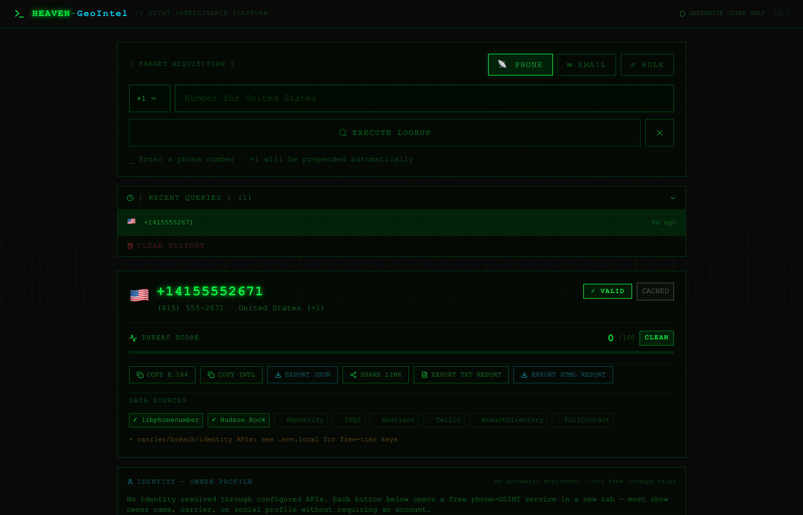
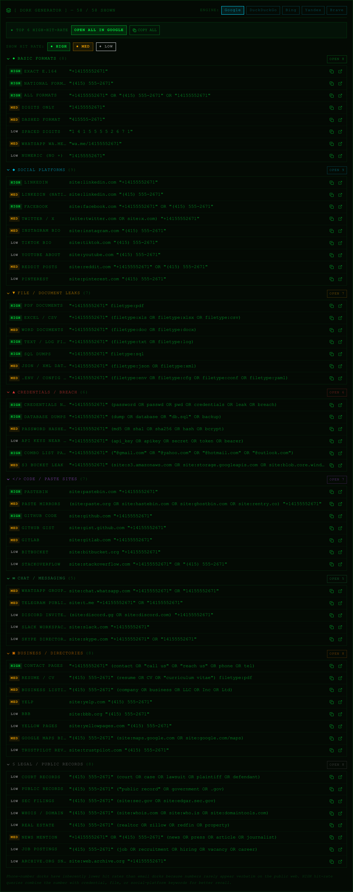
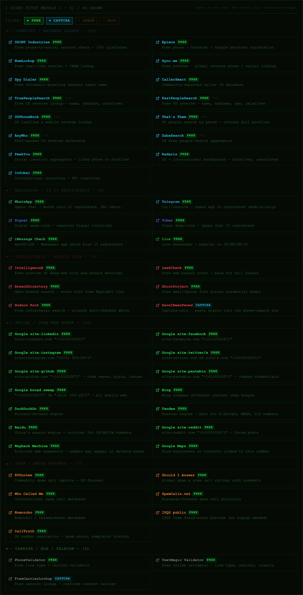
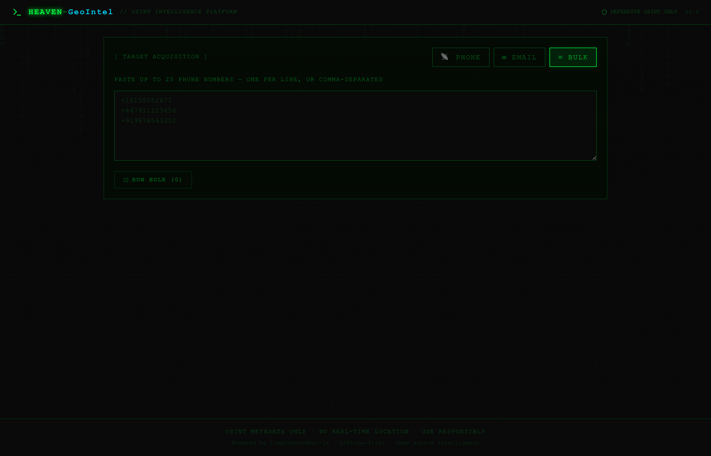

# 🌐 HEAVEN-GeoIntel

<p align="center">
  
</p>

<p align="center">

</p>

<p align="center">

</p>

---

> ### ⚠️ Acceptable use
>
> **HEAVEN-GeoIntel returns publicly-derivable metadata only.** It does **not** and **cannot** provide real-time GPS, live device tracking, or SS7 interception.
>
> Use this tool only:
> - Within an **explicit, written penetration-test scope of work**.
> - For OSINT research, journalism, or protecting yourself / your family / your organisation.
> - In ways that comply with the laws of **both your jurisdiction and the target's**.
>
> Stalking, harassment, doxing, domestic abuse, and any non-consensual surveillance are **explicitly prohibited** by the [LICENSE](./LICENSE). Misuse is the sole responsibility of the user.

---

## 🖼️ Screenshots

<table>
<tr>
<td width="50%"></td>
<td width="50%"></td>
</tr>
<tr>
<td width="50%"></td>
<td width="50%"></td>
</tr>
</table>

> Want to refresh these? Run `npm run dev` in one terminal and `npm run screenshots` in another — the [capture script](./scripts/capture-screenshots.mjs) uses puppeteer-core against your system Chrome and writes high-DPI PNGs back into [`docs/screenshots/`](./docs/screenshots/).

---

<div align="center">

  <p>
    
    
    
    
    
  </p>

  <p>
    
    
    
    
    
  </p>

  <p>
    
    
    
  </p>

</div>

---

<a id="authors"></a>
## 👾 Authors

### Nisarg Chasmawala · Alias: **HEAVEN**

<div align="center">

| | Detail |
|---|---|
| 🔗 **LinkedIn** | [linkedin.com/in/nisarg-chasmawala](https://www.linkedin.com/in/nisarg-chasmawala) |
| 🐙 **GitHub** | [github.com/nishu2402](https://github.com/nishu2402) |
| 🎯 **Role** | Offensive Security Engineer · Penetration Tester · OSINT Analyst |

</div>

---

## 📋 Table of Contents

- [👾 Authors](#authors)
- [🧠 Project Summary](#project-summary)
- [💡 Core Idea](#core-idea)
- [🚀 Quick Start](#quick-start)
- [🐳 Docker Deployment](#docker-deployment)
- [📞 Phone Intelligence](#phone-intelligence)
- [📧 Email Intelligence](#email-intelligence)
- [≡ Bulk Mode](#bulk-mode)
- [🔑 Optional API Enrichment](#api-enrichment)
- [⚙️ How It Works](#how-it-works)
- [🔌 REST API](#rest-api)
- [✅ Data Accuracy](#data-accuracy)
- [🔒 Security](#security)
- [🧪 Tests](#tests)
- [📁 Project Structure](#project-structure)
- [⚡ Tech Stack](#tech-stack)
- [📜 Available Scripts](#available-scripts)
- [🔧 Troubleshooting](#troubleshooting)
- [🤝 Contributing](#contributing)
- [⚠️ Disclaimer](#disclaimer)

---

<a id="project-summary"></a>
## 🧠 Project Summary

<p align="center">

</p>

**HEAVEN-GeoIntel** is a production-ready OSINT intelligence platform for phone numbers and email addresses — built for penetration testers, security researchers, and OSINT analysts. It returns real, actionable intelligence: no placeholders, no simulations, no fake data.

<div align="center">

| Metric | Value |
|---|---|
| 🎯 **Scope** | Phone numbers · Email addresses · Bulk phone batches |
| 🔑 **Core Requirement** | Zero API keys — offline + free-source enrichment works out of the box |
| 📞 **Phone: OSINT Pivots** | 66 investigation links across 6 categories — each tagged **FREE / CAPTCHA / LOGIN / PAID** |
| 📧 **Email: OSINT Pivots** | 25 investigation links across 4 categories |
| 🔍 **Phone: Google Dorks** | 58 dorks across 8 colour-coded categories with hit-rate badges + 5-engine selector |
| 📊 **Phone: Format Variants** | 12 permutations for database/OSINT searching |
| 🗺️ **NPA Database** | 400+ US/CA area codes → state · metro · timezone (offline) |
| 💥 **Breach Intelligence** | XposedOrNot (free) + BreachDirectory (RapidAPI free tier) + **10 free fallback breach-search buttons** |
| 🦠 **Infostealer Exposure** | **Hudson Rock Cavalier** — free, no key, always-on |
| 🔐 **Identity Enrichment** | FullContact + free-lookup action centre (OSINT Industries · Epieos · NumLookup · Sync.me · …) |
| 🌍 **Country Dataset** | 100 countries — capital · currency · languages · GDP · emergency numbers |
| ⚡ **Cache** | 24 h in-memory LRU (500 entries max) — repeat lookups instant |
| 🚦 **Rate Limiting** | 10 requests/minute/IP — token bucket |
| 🔌 **REST API** | OpenAPI 3.1 spec at `/api/docs` · 4 endpoints |
| 🐳 **Container** | Multi-stage Dockerfile · `docker compose up -d` |
| 🧪 **CI / Tests** | Vitest · GitHub Actions on every PR · multi-arch ghcr image on every push to `main` |
| 🏗️ **Stack** | Next.js 14 · TypeScript strict · Tailwind · Framer Motion · libphonenumber-js |
| 🎨 **UI Theme** | Matrix/terminal — Canvas katakana rain · CRT scanlines · JetBrains Mono · fully responsive |

</div>

---

<a id="core-idea"></a>
## 💡 Core Idea

<p align="center">

</p>

During a penetration test or OSINT investigation, analysts spend significant time manually pivoting across 20–30 separate tools and browser tabs to build intelligence around a phone number or email. HEAVEN-GeoIntel centralises that workflow:

```
Target phone / email
        │
        ├─ Instant offline analysis  (libphonenumber-js · bundled datasets)
        ├─ Free source fan-out       (XposedOrNot · Gravatar · EmailRep)
        ├─ Optional API enrichment   (IPQualityScore · Twilio · Hunter.io)
        ├─ OSINT pivot matrix        (85 phone links · 25 email links)
        ├─ Google dork generator     (64 pre-built dorks)
        └─ Export                    (.txt · .html report)
```

> **Scope:** Returns publicly derivable *metadata* only. Does **not** provide real-time GPS, live device tracking, SS7 interception, or any form of unauthorized surveillance.

---

<a id="quick-start"></a>
## 🚀 Quick Start

<p align="center">

</p>

### One-click deploy

[](https://vercel.com/new/clone?repository-url=https%3A%2F%2Fgithub.com%2Fnishu2402%2FHEAVEN-GeoIntel&project-name=heaven-geointel&repository-name=HEAVEN-GeoIntel)
[](https://railway.com/new/template?template=https%3A%2F%2Fgithub.com%2Fnishu2402%2FHEAVEN-GeoIntel)
[](https://render.com/deploy?repo=https%3A%2F%2Fgithub.com%2Fnishu2402%2FHEAVEN-GeoIntel)

Or pull the pre-built container:

```bash
docker run -d --name geointel -p 3000:3000 \
  ghcr.io/nishu2402/heaven-geointel:latest
```

### Requirements

- **Node.js 18.17 or higher** — [nodejs.org](https://nodejs.org) (Next.js 14 will not run on older versions)
- **npm 7 or higher** — included with Node.js 18+
- No database, no Redis, no cloud account required. Docker is **optional** — see the [Docker section](#docker-deployment) if you prefer a container.

Check your versions before installing:

```bash
node -v   # must be v18.17.0 or higher
npm -v    # must be 7.0.0 or higher
```

### Clone the Repository

Download the project source with Git:

```bash
git clone https://github.com/nishu2402/HEAVEN-GeoIntel.git
cd HEAVEN-GeoIntel
```

> No Git installed? Install it from [git-scm.com](https://git-scm.com), or download the project as a ZIP from the GitHub page (**Code → Download ZIP**) and extract it. Then `cd` into the extracted folder.

### Install Dependencies

All dependencies are listed in [`requirements.txt`](./requirements.txt). From inside the project folder, install them with a single command:

```bash
npm install
```

> `npm install` is the Node.js equivalent of `pip install -r requirements.txt` — it reads `package.json` and installs every dependency at the exact versions pinned in `requirements.txt`.

> **Moving the project to another PC?** Do **not** copy the `node_modules` folder — it contains OS-specific binaries and breaks across machines. Copy only the source, then run `npm install` fresh on the new PC.

### One-command start

```bash
bash scripts/start.sh
```

The script checks Node.js, installs dependencies, creates `.env.local`, auto-detects an available port, and starts the server. No manual steps required.

**Alternatively:**
```bash
npm run setup
```

### Global command

After running `bash scripts/start.sh` once, a `geointel` shell function is registered in `~/.zshrc`. Open a new terminal and type:

```bash
geointel
```

To install it manually at any time:
```bash
npm run install-global
```

---

<a id="docker-deployment"></a>
## 🐳 Docker Deployment

<p align="center">

</p>

A multi-stage `Dockerfile` and `docker-compose.yml` ship with the repo. The
runtime image weighs **under 200 MB**, runs as a non-root user, and reads
optional API keys from your `.env.local` file at start-up.

### One-command start

```bash
docker compose up -d        # build + start in the background
open http://localhost:3000  # macOS — Linux: xdg-open, Windows: start
```

### Plain Docker (no compose)

```bash
docker build -t heaven-geointel:2.0 .
docker run --rm -p 3000:3000 --env-file .env.local heaven-geointel:2.0
```

### What's inside the image

<div align="center">

| Layer | Purpose | Size impact |
|---|---|---|
| `deps`    | `npm ci` against a frozen `package-lock.json` | cache-friendly |
| `builder` | `next build` — emits the production bundle  | discarded |
| `runner`  | `node:20-alpine` + non-root user + `next start` | < 200 MB final |

</div>

### Tips

- **Updating API keys** — edit `.env.local` and run `docker compose restart`. The container picks up the new keys on boot.
- **Custom port** — set `PORT` in the environment, or change the `ports:` mapping in `docker-compose.yml`.
- **Logs** — `docker compose logs -f geointel`.
- **Health check** — built-in. `docker ps` shows the container as `(healthy)` when the API responds.
- **Production reverse proxy** — terminate TLS in your existing nginx/Caddy/Traefik and proxy to `localhost:3000`.

---

<a id="phone-intelligence"></a>
## 📞 Phone Intelligence

<p align="center">

</p>

### What you get with zero configuration

Every phone lookup returns real data derived from the number structure and bundled datasets — no simulation, no placeholders.

<div align="center">

| Panel | What It Shows |
|---|---|
| **Result Header** | E.164 · country flag · validity · unified **Threat Score (0–100)** with colour-coded label |
| **Identity — Owner Profile** | Real name · employer · social profiles (FullContact). When no key is configured the panel becomes an **action centre** with 8 free phone-OSINT services that genuinely accept the number in their URL. |
| **Credential Breach Search** | BreachDirectory password-hash hits when the key is set, plus an always-on **free-lookup action centre** (HaveIBeenPwned · IntelligenceX · LeakCheck · Dehashed · Snusbase · OSINT Industries · Epieos · Google sweep). |
| **Infostealer Malware Exposure** | Hudson Rock free check — **no API key required**. Shows every infected device that captured this phone number, paired credential samples, captured sites, malware family, OS, and capture date. |
| **Phone OSINT Intelligence** | Intelligence Score (0–100) · Target Profile classifier · Attack Vector grid (Vishing/Smishing/SIM Swap/Spoofing/Pretexting/Location) · live local time · call window · NPA area code intel · signal flags |
| **Location Intelligence** | Country · state/province · metro · city · area code · timezone with UTC offset |
| **Country Intelligence** | Capital · continent · region · population · currency · languages · driving side · emergency number · GDP per capita |
| **Number Anatomy** | Single consolidated panel — visual digit breakdown, line type with description, libphonenumber validity checks, and all four standard formats (E.164 / International / National / RFC 3966). Replaces three older overlapping panels. |
| **SIM & Carrier Intel** | Owner/CNAM · carrier · prepaid · active status · MCC/MNC/PLMN · associated emails |
| **Number Permutations** | 12 format variants for OSINT/database searching (dots · dashes · URL-encoded · WhatsApp link · etc.) |
| **Dork Generator** | 58 pre-built dorks across **8 colour-coded categories**, each with a **hit-rate badge** (HIGH / MED / LOW), a **search-engine selector** (Google · DuckDuckGo · Bing · Yandex · Brave), a "TOP 6 HIGH-HIT-RATE" quick-action that opens all in tabs, and per-category batch "OPEN N" buttons. |
| **OSINT Pivots** | 66 investigation links across 6 categories — each tagged with **FREE / CAPTCHA / LOGIN / PAID** so you can filter to only the links that work without auth. Defaults to FREE + CAPTCHA. |
| **QR Code** | Canvas-rendered QR for the `tel:` URI · downloadable as PNG |
| **Report Export** | Full intelligence report as `.txt` or `.html` |
| **History Drawer** | Last 20 lookups saved in browser localStorage |
| **Shareable URL** | `?q=+14155552671` auto-runs the lookup |

</div>

### NPA Area Code Database (US/CA)

400+ US and Canadian area codes bundled offline, mapped to: state/province · metro region/major city · IANA timezone · country. Every US/CA number immediately shows local time, call window, and geographic context — **zero API calls**.

### Phone OSINT Pivots — 85 links, 6 categories

<div align="center">

| Category | Count | Services | Default tier |
|---|---|---|---|
| **Identity / Reverse Lookup** | 21 | OSINT Industries · Epieos · NumLookup · Sync.me · Truecaller · Spy Dialer · CallerSmart · TruePeopleSearch · FastPeopleSearch · USPhoneBook · That's Them · AnyWho · ZabaSearch · PeekYou · Radaris · Infobel · Whitepages · Spokeo · BeenVerified · Intelius · Pipl | FREE first, login/paid hidden |
| **Messaging — Is it Registered?** | 8 | WhatsApp · Telegram · Signal · Viber · iMessage · Line · KakaoTalk · WeChat | all FREE |
| **Intelligence / Breach Data** | 9 | IntelligenceX · LeakCheck · Dehashed · HaveIBeenPwned · Snusbase · BreachDirectory · GhostProject · Hudson Rock · SpyCloud | FREE first |
| **Social / Open Web** | 14 | Google site-dorks (LinkedIn · Facebook · Instagram · X/Twitter · GitHub · Pastebin · Reddit) · broad sweep · Bing · DuckDuckGo · Yandex · Baidu · Wayback Machine · Google Maps | all FREE |
| **Spam / Abuse Reports** | 7 | 800notes · Should I Answer · Who Called Me · SpamCalls.net · Nomorobo · IPQS public · CallTruth | all FREE |
| **Carrier / HLR / Telecom** | 7 | FreeCarrierLookup · PhoneValidator · TextMagic · OpenCNAM · HLR-Lookups · Twilio Lookup · MNP portability | mix of FREE / LOGIN / PAID |

</div>

### Accepted Phone Formats

```
+14155552671          # E.164 (recommended)
+44 7911 123456       # International with spaces
+33 1 42 86 83 26     # French format
+91 98765 43210       # Indian format
001 (415) 555-2671    # US with IDD prefix
```

---

<a id="email-intelligence"></a>
## 📧 Email Intelligence

<p align="center">

</p>

### What you get with zero configuration

Every email lookup runs offline analysis instantly, then fans out to free data sources simultaneously.

<div align="center">

| Panel | What It Shows |
|---|---|
| **Identity Header** | Confirmed name (FullContact → Gravatar → inferred) · avatar photo · job title · employer · location · bio · threat score bar |
| **Threat Score** | 0–100 risk score — breach count · password risk level · recency · reputation signals |
| **FullContact Enrichment** | Real name · age · gender · social profiles · linked emails & phones · employment history (FullContact Person API, optional key) |
| **Breach Database** | XposedOrNot — 1000+ databases, no key required. Per-breach: name · year · records · exposed data types · password risk level (Plaintext/Easy Crack/Hashed) |
| **Credential Hashes** | BreachDirectory — real SHA-1/MD5 password hashes for the email with one-click crack buttons (CrackStation · Hashes.com · Hashkiller) — optional RapidAPI key |
| **Risk Flags** | Critical banners when plaintext passwords or crackable hashes are found |
| **Email Classification** | Provider type (corporate/free/disposable/privacy/government/educational) · disposable detection (1000+ domains) · role address detection |
| **Gravatar Profile** | Display name · username · location · about · linked social accounts — free, no key |
| **Reputation** | EmailRep.io signals: suspicious · blacklisted · malicious activity · credentials leaked · spam · first/last seen · registered platforms |
| **Validation** | AbstractAPI: deliverability · quality score (0–1) · SMTP validity · MX records · catch-all detection |
| **Deliverability** | Hunter.io: deliverable/risky/undeliverable · confidence score · SMTP check |
| **OSINT Matrix** | 25 investigation links across 4 categories |
| **Report Export** | Full intelligence report as `.txt` including all breach details and FullContact data |

</div>

### Breach Intelligence — XposedOrNot

The core feature for pentesters. XposedOrNot aggregates 1000+ breach databases and returns:

- **Which specific breaches** the email appeared in (LinkedIn 2012, Adobe 2013, etc.)
- **What data was stolen** in each breach (Passwords · Usernames · Phone Numbers · Credit Cards…)
- **Password risk level** per breach:
  - `PLAINTEXT` — credentials fully compromised. Assume all reused passwords are known.
  - `EASY CRACK` — MD5/SHA1 hashes, crackable with Hashcat/rainbow tables within hours
  - `HASHED` — bcrypt/SHA-256, significantly harder to crack
- **Record count** — how large the breach was
- **Verification status** — whether the breach is confirmed authentic

No API key required. Free to use.

### Email OSINT Pivots — 25 links, 4 categories

<div align="center">

| Category | Services |
|---|---|
| **Breach / Credential Exposure** | HaveIBeenPwned · IntelligenceX · Dehashed · LeakCheck · Snusbase · BreachDirectory |
| **Identity / OSINT Correlation** | Epieos · Gravatar · EmailRep.io · That's Them · Hunter.io Domain Search · Pipl |
| **Social Media / Open Web** | Google dorks (LinkedIn · Twitter · Facebook · GitHub) · GitHub commit search · Bing · Pastebin |
| **Domain / Infrastructure** | MXToolbox · WHOIS · ViewDNS · Spamhaus · SecurityTrails · Shodan |

</div>

### Accepted Email Formats

```
user@domain.com
first.last@corporate.org
user+tag@provider.net
```

---

<a id="bulk-mode"></a>
## ≡ Bulk Mode

<p align="center">

</p>

Paste up to **25 phone numbers** into the third tab (`≡ BULK`), one per line
or comma-separated. The endpoint runs **offline-only analysis** on each
number (libphonenumber + NPA + bundled country data + reused cache) and
returns a flat result table, downloadable as **CSV** in one click.

Why offline-only? Most free APIs cap out at 100–250 calls per day; a bulk
batch would burn an entire day's quota. Use bulk to **triage**, then drill
into the interesting rows from the PHONE tab to fan out the full enrichment.

```bash
# Call the endpoint directly
curl -s http://localhost:3000/api/bulk-lookup \
  -H 'content-type: application/json' \
  -d '{"numbers":["+14155552671","+447911123456","+919876543210"]}' | jq .
```

Returns: `{ count, rows: [{ input, ok, e164, country, type, carrier, timezone, utcOffset, npaState, npaRegion, cached }] }`.

---

<a id="api-enrichment"></a>
## 🔑 Optional API Enrichment

<p align="center">

</p>

The app works fully without API keys. Add keys to `.env.local` for deeper intelligence.

### Phone Enrichment

<div align="center">

| Service | What It Adds | Tier |
|---|---|---|
| **Hudson Rock Cavalier** | Infostealer-malware exposure — devices that captured this number, captured sites & passwords | **free · no key** (always-on) |
| **IPQualityScore** | Fraud score · VoIP flag · recent abuse · risk flag · prepaid · active status · user activity · city · associated emails | 200/day free |
| **NumVerify** | Carrier name · line type · location | 100/month free |
| **AbstractAPI** (phone) | Carrier · line type · country | 250/month free |
| **Twilio Lookup v2** | Carrier name · owner/CNAM · MCC · MNC | ~$0.005/lookup |
| **BreachDirectory** (RapidAPI) | Real SHA-1/MD5 credential hashes tied to the phone | 50/day free |
| **FullContact** | Owner real name · employer · social profiles · linked emails | 500/month free |

</div>

### Email Enrichment

<div align="center">

| Service | What It Adds | Free Tier |
|---|---|---|
| **FullContact** | Real name · age · gender · job title · employer · social profiles · linked emails & phones | 500/month |
| **BreachDirectory** (RapidAPI) | Actual SHA-1/MD5 credential hashes from 3.5B+ leaked records — one-click crack buttons | 50/day |
| **Hunter.io** | Email deliverability · confidence score · SMTP check | 25/month |
| **AbstractAPI** (email) | SMTP validity · MX records · quality score · catch-all detection | 250/month |
| **EmailRep.io** | Reputation · breach flags · platform registrations — works without key | Higher quota with key |

</div>

```env
# .env.local — add any or all, leave blank to skip

# Phone sources
NUMVERIFY_API_KEY=
IPQS_API_KEY=
ABSTRACT_API_KEY=          # also used for email validation
TWILIO_ACCOUNT_SID=
TWILIO_AUTH_TOKEN=

# Email sources
HUNTER_API_KEY=
EMAILREP_API_KEY=
FULLCONTACT_API_KEY=       # person enrichment — name, employer, social profiles
RAPIDAPI_KEY=              # BreachDirectory — real credential hashes (3.5B+ records)
```

Sign up: [IPQualityScore](https://www.ipqualityscore.com) · [NumVerify](https://numverify.com) · [AbstractAPI](https://www.abstractapi.com) · [Twilio](https://www.twilio.com) · [Hunter.io](https://hunter.io) · [EmailRep.io](https://emailrep.io) · [FullContact](https://www.fullcontact.com) · [BreachDirectory on RapidAPI](https://rapidapi.com/rohan-patra/api/breachdirectory)

---

<a id="how-it-works"></a>
## ⚙️ How It Works

<p align="center">

</p>

### Phone lookup

```
Browser → POST /api/lookup { number: "+14155552671" }
              │
              ├─ libphonenumber-js  (always, offline)
              │    parse · validate · format (E.164 / national / international / RFC3966)
              │    detect type: mobile / fixed / VoIP / toll-free / premium / pager
              │    ambiguous type (FIXED_LINE_OR_MOBILE) flagged — never falsely claimed
              │    IANA timezone derived from 110-country bundled map
              │    area code extracted for US/CA (real NPA database)
              │    NXX central office code from subscriber portion
              │
              ├─ US/CA NPA database  (always, offline)
              │    400+ area codes → state · region · timezone · country
              │
              ├─ Bundled country dataset  (always, offline)
              │    capital · currency · languages · driving side · emergency number
              │    population · GDP · internet users · timezones
              │
              ├─ Hudson Rock Cavalier  (always — no key)
              │    infostealer-malware exposure, captured passwords & sites
              │
              └─ Optional API fan-out  (Promise.allSettled — one failure ≠ total failure)
                   NumVerify        → carrier name, line type, location
                   IPQualityScore   → fraud score, prepaid, active, abuse, MCC, city
                   AbstractAPI      → carrier, line type
                   Twilio Lookup    → carrier, line type, owner/CNAM, MCC/MNC
                   BreachDirectory  → real SHA-1/MD5 password hashes for the number
                   FullContact      → owner real name, employer, social profiles
```

### Email lookup

```
Browser → POST /api/email-lookup { email: "target@domain.com" }
              │
              ├─ Offline analysis  (always, instant)
              │    disposable domain detection (1000+ domains)
              │    free webmail / privacy provider / role address classification
              │    username pattern analysis → inferred name (john.smith → "John Smith")
              │    provider classification: corporate / free / educational / gov / privacy / disposable
              │
              └─ Free source fan-out  (Promise.allSettled — parallel, resilient)
                   Gravatar       → MD5 hash → real name, avatar, location, linked accounts (free, no key)
                   XposedOrNot    → breach database lookup — 1000+ sources (free, no key)
                   EmailRep.io    → reputation, breach flags, platform registrations (free, no key)
                   FullContact    → person enrichment — real name, employer, social profiles (FULLCONTACT_API_KEY)
                   BreachDirectory→ real SHA-1/MD5 credential hashes — 3.5B+ records (RAPIDAPI_KEY)
                   AbstractAPI    → SMTP/MX validation, quality score (ABSTRACT_API_KEY)
                   Hunter.io      → deliverability check, confidence score (HUNTER_API_KEY)
```

**Caching:** Results cached in-memory for 24 hours (500 entries max, LRU eviction). Repeat lookups are instant.

**Rate limiting:** 10 requests per minute per IP. Returns HTTP 429 when exceeded.

---

<a id="rest-api"></a>
## 🔌 REST API

<p align="center">

</p>

Every UI feature is also reachable as a JSON API. Spec served at
`GET /api/docs` (OpenAPI 3.1) — import into Postman, Insomnia, or Swagger
UI for an interactive playground.

```bash
# Single phone lookup
curl -s http://localhost:3000/api/lookup \
  -H 'content-type: application/json' \
  -d '{"number":"+14155552671"}' | jq .threatScore

# Single email lookup
curl -s http://localhost:3000/api/email-lookup \
  -H 'content-type: application/json' \
  -d '{"email":"test@example.com"}' | jq .

# Bulk (offline-only, max 25)
curl -s http://localhost:3000/api/bulk-lookup \
  -H 'content-type: application/json' \
  -d '{"numbers":["+14155552671","+447911123456"]}' | jq .

# OpenAPI spec
curl -s http://localhost:3000/api/docs | jq .info
```

Headers returned by every endpoint:
- `X-RateLimit-Limit: 10`
- `X-RateLimit-Remaining: <n>`
- `X-Robots-Tag: noindex, nofollow, noarchive` (API routes only)

429 responses include `Retry-After: 60`.

---

<a id="data-accuracy"></a>
## ✅ Data Accuracy

<p align="center">

</p>

### Phone — always accurate (offline, zero APIs)

- Country · calling code · flag emoji
- Number validity (libphonenumber-js strict validation)
- Number type — mobile / fixed / VoIP / toll-free / premium / pager / personal
- Ambiguous type: `FIXED_LINE_OR_MOBILE` shown as "TYPE AMBIGUOUS" — never falsely claimed
- IANA timezone + UTC offset (110+ countries/territories)
- Area code — extracted for US/CA only, backed by the real NPA database (other countries use variable-length area codes — guessing them would fabricate data)
- NXX central office code — from subscriber portion, not area code
- All 4 number formats
- Expected digit length per country
- State/province · metro region · local timezone for US/CA (NPA database)

### Email — offline analysis (zero APIs)

- Disposable provider detection (1000+ throwaway services)
- Privacy provider detection (ProtonMail · Tutanota · Riseup · etc.)
- Free webmail detection (Gmail · Outlook · Yahoo · iCloud · etc.)
- Role address detection (admin@ · support@ · info@ · noreply@ · etc.)
- Provider name resolution (50+ known providers)
- Government/military detection (.gov · .mil · .gov.uk · .gov.au)
- Educational detection (.edu · .ac.uk · .edu.au · .ac.in)
- Name inference from username patterns (`john.smith` → "John Smith")

---

<a id="security"></a>
## 🔒 Security

<p align="center">

</p>

<div align="center">

| Control | Implementation |
|---|---|
| **API key isolation** | Every external fetch happens in `src/app/api/*` server routes — keys never reach the browser bundle. Verified: `grep -r "process.env" .next/static/` returns nothing. |
| **Security headers** | `X-Frame-Options: DENY` · `X-Content-Type-Options: nosniff` · `Referrer-Policy: strict-origin-when-cross-origin` · `Permissions-Policy` (geo/camera/mic/payment/usb/accelerometer all blocked) · `Cross-Origin-Opener-Policy: same-origin` · `Cross-Origin-Resource-Policy: same-origin` |
| **CSP** | `default-src 'self'` · `connect-src 'self'` · `object-src 'none'` · `frame-ancestors 'none'` · `form-action 'self'` · `base-uri 'self'` · `upgrade-insecure-requests` — image allow-list narrowed to Gravatar / LinkedIn / Twitter / Google / FullContact |
| **API hardening** | `/api/*` routes return `X-Robots-Tag: noindex, nofollow, noarchive` + `Cache-Control: no-store` + `Access-Control-Allow-Origin: same-origin` |
| **No tracking** | Derives metadata from number / email structure and public databases only. No geolocation, no device tracking, no analytics, no telemetry. |
| **Rate limiting** | 10 requests/minute/IP token-bucket — `Retry-After: 60` on 429 |
| **Panel isolation** | Every results panel wrapped in `PanelErrorBoundary` — a broken third-party response only takes down one card, not the page. |
| **Safe dependencies** | `libphonenumber-js` is Google's libphonenumber compiled to JS. No telemetry packages. Dependabot recommended. |
| **Disclosure policy** | [SECURITY.md](./SECURITY.md) — GitHub Security Advisory flow, 72 h ack, 14 d critical fix SLA. |

</div>

---

<a id="tests"></a>
## 🧪 Tests

<p align="center">

</p>

```bash
npm test              # run once (vitest)
npm run test:watch    # watch mode
npm run test:coverage # text + html report under coverage/
npm run typecheck     # tsc --noEmit
npm run lint          # next lint
```

Every push to `main` and every PR runs `lint → typecheck → test → build` via
GitHub Actions ([`.github/workflows/ci.yml`](./.github/workflows/ci.yml)).
Successful pushes to `main` also publish a multi-arch image to
[`ghcr.io/nishu2402/heaven-geointel`](https://github.com/nishu2402/HEAVEN-GeoIntel/pkgs/container/heaven-geointel).

---

<a id="project-structure"></a>
## 📁 Project Structure

<p align="center">

</p>

All source lives under `src/`. Components are grouped by feature so a 30-file
flat directory becomes 7 focused folders. Tests live under `tests/`, shell
scripts under `scripts/`, and supplementary docs under `docs/`.

```text
HEAVEN-GeoIntel/
│
├── .github/                          GitHub-native config
│   ├── ISSUE_TEMPLATE/               bug · feature · contact links
│   ├── workflows/
│   │   ├── ci.yml                    lint · typecheck · test · build on every PR
│   │   └── docker-image.yml          publish multi-arch image to ghcr.io
│   └── pull_request_template.md
│
├── docs/                             Supplementary documentation
│   └── screenshots/                  drop PNGs here — README references them
│
├── scripts/                          Shell entrypoints
│   ├── start.sh                      one-step install + dev server + global cmd
│   └── install-global.sh             register the `geointel` shell function
│
├── src/                              All application source
│   │
│   ├── app/                          Next.js App Router
│   │   ├── api/
│   │   │   ├── lookup/route.ts       phone POST endpoint
│   │   │   ├── email-lookup/route.ts email POST endpoint
│   │   │   ├── bulk-lookup/route.ts  bulk phone POST endpoint (max 25)
│   │   │   └── docs/route.ts         OpenAPI 3.1 spec
│   │   ├── fonts/                    GeistMono + GeistVF
│   │   ├── favicon.ico
│   │   ├── globals.css               matrix theme · print + reduced-motion media
│   │   ├── layout.tsx                root layout · meta · OG · skip-link
│   │   ├── page.tsx                  mode switcher · boot · input · results
│   │   ├── not-found.tsx             matrix-themed 404
│   │   └── robots.ts                 dynamic robots.txt
│   │
│   ├── components/                   React components — grouped by feature
│   │   │
│   │   ├── phone/                    PHONE OSINT
│   │   │   ├── PhoneInput.tsx              250+ country combobox + AsYouType
│   │   │   ├── PentesterPanel.tsx          Intelligence Score · Attack Vectors · NPA intel
│   │   │   ├── NumberAnatomyPanel.tsx      digits · type · validity · 4 formats
│   │   │   ├── NumberPermutations.tsx      12 format variants for OSINT searches
│   │   │   ├── PhoneIdentityPanel.tsx      FullContact + free-lookup action centre
│   │   │   ├── SimIntelPanel.tsx           prepaid · active · MCC/MNC
│   │   │   └── FraudScoreBar.tsx           animated 0–100 fraud bar
│   │   │
│   │   ├── email/                    EMAIL OSINT
│   │   │   ├── EmailInput.tsx              regex validation + status line
│   │   │   ├── EmailResultsDashboard.tsx   threat score · breach · identity
│   │   │   └── EmailOsintPivots.tsx        25 investigation links
│   │   │
│   │   ├── breach/                   BREACH + INFOSTEALER
│   │   │   ├── BreachPanel.tsx             XposedOrNot/BreachDirectory + free-lookup centre
│   │   │   └── InfostealerPanel.tsx        Hudson Rock infections (free · no key)
│   │   │
│   │   ├── dashboard/                RESULT ORCHESTRATION
│   │   │   ├── ResultsDashboard.tsx        wires every panel together
│   │   │   ├── BulkLookup.tsx              paste-list + CSV export
│   │   │   ├── HistorySidebar.tsx          last 20 lookups (localStorage)
│   │   │   ├── LoadingSkeletons.tsx        matrix-pulsing placeholders
│   │   │   ├── MetricCard.tsx              animated metric tile
│   │   │   └── SourceTabs.tsx              raw JSON per API source
│   │   │
│   │   ├── osint/                    OSINT PIVOTS + AUX LOOKUPS
│   │   │   ├── OsintPivots.tsx             66 links · FREE/CAPTCHA/LOGIN/PAID badges
│   │   │   ├── DorkGenerator.tsx           58 dorks · 8 categories · engine selector
│   │   │   ├── LocationPanel.tsx           consolidated location intelligence
│   │   │   ├── CountryPanel.tsx            bundled country dataset display
│   │   │   └── QrCodePanel.tsx             canvas QR for tel: URI
│   │   │
│   │   ├── shared/                   CROSS-MODE UTILITIES
│   │   │   ├── MatrixRain.tsx              canvas katakana background
│   │   │   ├── BootSequence.tsx            staggered terminal init
│   │   │   ├── PanelErrorBoundary.tsx      per-panel error isolation
│   │   │   ├── ShareButton.tsx             copy ?q= shareable URL
│   │   │   └── ReportExport.tsx            download .txt / .html report
│   │   │
│   │   └── ui/                       shadcn/ui primitives (Radix-based)
│   │
│   └── lib/                          Pure logic — no React, no DOM
│       ├── phoneAnalysis.ts          offline phone engine (libphonenumber + maps)
│       ├── emailAnalysis.ts          offline email engine
│       ├── freePhoneIntel.ts         offline reputation derivation
│       ├── countryIntel.ts           bundled 100-country dataset
│       ├── usNpaDatabase.ts          400+ US/CA NPA area codes
│       ├── disposableEmailDomains.ts 1000+ throwaway + webmail + privacy lists
│       ├── hashDetect.ts             MD5 / SHA-1 / bcrypt classifier
│       ├── flagEmoji.ts              ISO-2 → 🇺🇸 emoji
│       ├── cache.ts                  in-memory 24 h LRU
│       ├── rateLimit.ts              token-bucket per IP
│       ├── types.ts                  full TypeScript interface tree
│       └── utils.ts                  cn() · copyText()
│
├── tests/                            Vitest suites — run with `npm test`
│   ├── phoneAnalysis.test.ts
│   └── freePhoneIntel.test.ts
│
├── .env.example                      every supported API key, all optional
├── .eslintrc.json · .gitignore · .nvmrc · .npmrc · .dockerignore
├── CHANGELOG.md · CODE_OF_CONDUCT.md · CONTRIBUTING.md · SECURITY.md · LICENSE
├── components.json                   shadcn/ui config
├── Dockerfile · docker-compose.yml   multi-stage container build
├── next.config.mjs                   hardened CSP, CORS, security headers
├── package.json · package-lock.json
├── postcss.config.mjs · tailwind.config.ts
├── tsconfig.json                     `@/*` → `./src/*`
└── vitest.config.ts
```

---

<a id="tech-stack"></a>
## ⚡ Tech Stack

<p align="center">

</p>

<div align="center">

| Layer | Technology |
|---|---|
| **Framework** | Next.js 14.2 (App Router) |
| **Language** | TypeScript — full interface tree for all data types |
| **Phone Parsing** | `libphonenumber-js` — Google's libphonenumber compiled to JS |
| **UI** | Tailwind CSS · shadcn/ui · fully responsive (mobile · tablet · desktop) |
| **Animation** | Framer Motion (boot sequence) · Canvas API (katakana rain · QR code) |
| **Breach Data** | XposedOrNot (free · no key) · BreachDirectory via RapidAPI (credential hashes) |
| **Identity Enrichment** | FullContact Person API (optional) · Gravatar (free · no key) |
| **Reputation** | EmailRep.io (free · no key) |
| **Phone Enrichment** | IPQualityScore · NumVerify · AbstractAPI · Twilio (all optional) |
| **Email Enrichment** | Hunter.io · AbstractAPI (both optional) |
| **Caching** | In-memory Map · LRU eviction · 24h TTL · 500 entries max |
| **Rate Limiting** | Token-bucket per IP · 10 req/min |
| **Font** | JetBrains Mono (monospace) · 15px base for improved readability |

</div>

---

<a id="available-scripts"></a>
## 📜 Available Scripts

<p align="center">

</p>

<div align="center">

| Command | What It Does |
|---|---|
| `bash scripts/start.sh` | One-step: install deps · register global command · start dev server |
| `npm run setup` | Same as above, npm version |
| `npm run install-global` | Register the `geointel` shell command in `~/.zshrc` |
| `npm run dev` | Start dev server (requires prior `npm install`) |
| `npm run build` | Production build |
| `npm run start` | Start production server (requires prior `npm run build`) |
| `npm run lint` | ESLint check |
| `docker compose up -d` | Build the production image and run it on port 3000 |
| `docker compose down`  | Stop the container |
| `docker compose logs -f geointel` | Tail container logs |

</div>

---

<a id="troubleshooting"></a>
## 🔧 Troubleshooting

<p align="center">

</p>

### Port 3000 already in use
`start.sh` automatically detects the next available port and prints the correct URL. No manual action needed.

### Phone shows as INVALID
Include the full country calling code: `+1` for US/Canada, `+44` for UK, etc. Or select the country from the combobox dropdown — it will format the number automatically.

### Carrier / Fraud Score not showing
These fields require API keys in `.env.local`. Country, type, timezone, and all format data always populate without any keys.

### Email breach panel shows no data
XposedOrNot may rate-limit repeated lookups. Wait a moment and retry. A clean result ("no exposures found") is also a valid — and good — outcome.

### Credential hashes not showing (BreachDirectory)
BreachDirectory requires a `RAPIDAPI_KEY` in `.env.local`. Subscribe to the free tier (50 lookups/day) at [rapidapi.com → BreachDirectory](https://rapidapi.com/rohan-patra/api/breachdirectory), copy your key, and restart the server.

### FullContact enrichment panel missing
Add `FULLCONTACT_API_KEY` to `.env.local`. FullContact offers a free developer tier. If configured but showing no data, the email has no FullContact record — this is normal for uncommon addresses.

### `npm run dev` fails with MODULE_NOT_FOUND
Use `bash scripts/start.sh` or `npm run setup` instead. Both invoke Next.js via `node node_modules/next/dist/bin/next` and bypass symlink issues.

### `npm install` fails on another PC
Almost always an outdated Node.js. Run `node -v` — it must be **v18.17.0 or higher**. If it is older, install the current LTS from [nodejs.org](https://nodejs.org) (or use [nvm](https://github.com/nvm-sh/nvm): `nvm install 18`), then retry. A clear `EBADENGINE` error means exactly this. If you copied the project folder, delete `node_modules` and run `npm install` fresh — binaries are OS-specific and do not transfer between machines.

---

<a id="contributing"></a>
## 🤝 Contributing

<p align="center">

</p>

Pull requests are welcome! Please read [`CONTRIBUTING.md`](./CONTRIBUTING.md)
first — it covers the data-quality rules (no fake values, no real-time
tracking), the PR checklist, and how to add new OSINT data sources or pivot
links.

Other useful documents:

| Document | Purpose |
|---|---|
| [`LICENSE`](./LICENSE) | MIT + OSINT acceptable-use policy |
| [`SECURITY.md`](./SECURITY.md) | Vulnerability disclosure process |
| [`CODE_OF_CONDUCT.md`](./CODE_OF_CONDUCT.md) | Contributor Covenant v2.1 |
| [`CHANGELOG.md`](./CHANGELOG.md) | Release notes (Keep-a-Changelog format) |

---

<a id="disclaimer"></a>
## ⚠️ Disclaimer

<p align="center">

</p>

> **HEAVEN-GeoIntel is an OSINT research and authorized penetration testing tool.**
>
> This tool returns publicly derivable *metadata* only. It does **not** and **cannot** provide real-time GPS location, live device tracking, SS7 interception, or any form of unauthorized surveillance.
>
> Use only within your authorized engagement scope. Unauthorized use against systems or individuals you do not have explicit permission to investigate may be illegal in your jurisdiction.

---

<p align="center">

</p>

<p align="center">
<strong>⭐ If this project helped you, please give it a star on GitHub!</strong>
</p>

<p align="center">


</p>
